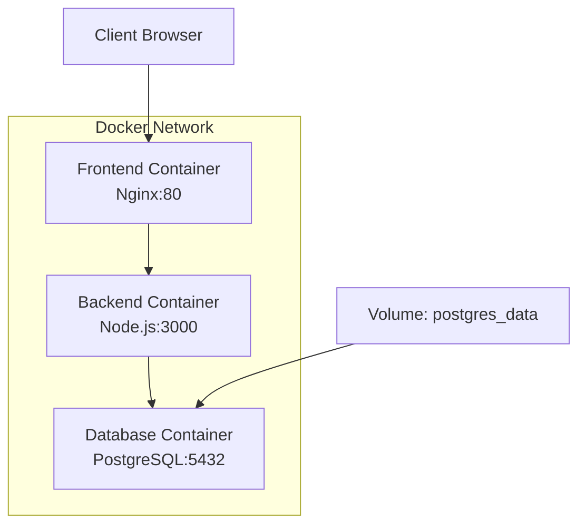

# Docker 部署指南

本项目使用 Docker 和 Docker Compose 进行容器化部署，包含前端、后端和数据库三个服务。

## 项目架构

```
Assignment Moderation System
├── Frontend (Nginx) - 端口 80
├── Backend (Node.js) - 端口 3000  
└── Database (PostgreSQL) - 端口 5432
```

## 前置要求

确保你的系统已安装以下软件：

- [Docker Desktop](https://www.docker.com/products/docker-desktop/) (Windows/Mac)
- [Docker Engine](https://docs.docker.com/engine/install/) (Linux)
- [Docker Compose](https://docs.docker.com/compose/install/) (通常包含在 Docker Desktop 中)

验证安装：
```bash
docker --version
docker-compose --version
```

## 快速启动

### 1. 克隆项目并进入目录
```bash
git clone <your-repository>
cd IT-Project-80
```

### 2. 启动所有服务
```bash
# 构建并启动所有容器
docker-compose up --build

# 或者在后台运行
docker-compose up --build -d
```

### 3. 访问应用
- **前端**: http://localhost
- **后端API**: http://localhost:3000/api
- **健康检查**: http://localhost:3000/api/health
- **数据库**: localhost:5432 (用户名: postgres, 密码: 2004416Xrn)

## 常用命令

### 服务管理
```bash
# 启动服务
docker-compose up

# 后台启动
docker-compose up -d

# 停止服务
docker-compose down

# 停止并删除卷数据
docker-compose down -v

# 重启特定服务
docker-compose restart backend

# 查看服务状态
docker-compose ps

# 查看服务日志
docker-compose logs
docker-compose logs backend  # 查看特定服务日志
docker-compose logs -f frontend  # 实时跟踪日志
```

### 构建管理
```bash
# 重新构建所有镜像
docker-compose build

# 重新构建特定服务
docker-compose build backend

# 强制重新构建（不使用缓存）
docker-compose build --no-cache

# 拉取最新基础镜像并构建
docker-compose build --pull
```

### 数据库管理
```bash
# 进入数据库容器
docker-compose exec database psql -U postgres -d assignment_mod

# 备份数据库
docker-compose exec database pg_dump -U postgres assignment_mod > backup.sql

# 恢复数据库
docker-compose exec -T database psql -U postgres assignment_mod < backup.sql

# 查看数据库日志
docker-compose logs database
```

### 调试和开发
```bash
# 进入容器内部
docker-compose exec backend sh
docker-compose exec frontend sh

# 查看容器内文件
docker-compose exec backend ls -la /app

# 实时查看所有日志
docker-compose logs -f

# 只启动数据库（用于本地开发）
docker-compose up database
```

## 服务配置

### 端口映射
- Frontend: 80:80
- Backend: 3000:3000
- Database: 5432:5432

### 环境变量
环境变量在 `docker-compose.yml` 中配置，也可以通过 `docker.env` 文件自定义：

```env
# 数据库配置
DB_HOST=database
DB_PORT=5432
DB_NAME=assignment_mod
DB_USER=postgres
DB_PASSWORD=040104

# 后端配置
NODE_ENV=production
PORT=3000
```

### 数据持久化
PostgreSQL 数据存储在 Docker 卷 `assignment_postgres_data` 中，数据会在容器重启后保持。

## 故障排除

### 常见问题

1. **端口占用**
   ```bash
   # 检查端口使用情况
   netstat -tulpn | grep :80
   netstat -tulpn | grep :3000
   
   # 停止占用端口的进程或修改 docker-compose.yml 中的端口映射
   ```

2. **容器启动失败**
   ```bash
   # 查看详细错误日志
   docker-compose logs <service-name>
   
   # 检查容器状态
   docker-compose ps
   ```

3. **数据库连接失败**
   ```bash
   # 检查数据库是否健康
   docker-compose exec database pg_isready -U postgres
   
   # 重启数据库服务
   docker-compose restart database
   ```

4. **磁盘空间不足**
   ```bash
   # 清理未使用的镜像和容器
   docker system prune
   
   # 清理未使用的卷
   docker volume prune
   ```

### 日志分析
```bash
# 查看所有服务状态
docker-compose ps

# 检查服务健康状态
docker-compose exec backend wget -qO- http://localhost:3000/api/health
docker-compose exec frontend wget -qO- http://localhost:80

# 实时监控资源使用
docker stats
```

## 开发模式

如果你想在开发过程中使用 Docker：

1. **只启动数据库**:
   ```bash
   docker-compose up database
   ```

2. **本地运行后端**:
   ```bash
   cd backend
   npm install
   npm start
   ```

3. **本地提供前端**:
   ```bash
   cd frontend
   # 使用任何静态文件服务器，如 Live Server
   ```

## 生产部署注意事项

1. **安全配置**:
   - 修改默认数据库密码
   - 使用环境变量管理敏感信息
   - 配置防火墙规则

2. **性能优化**:
   - 使用生产模式的 Node.js
   - 启用 Nginx 缓存
   - 配置数据库连接池

3. **监控和日志**:
   - 设置日志轮转
   - 配置健康检查
   - 使用监控工具

## 架构图



## 技术栈

- **Frontend**: HTML/CSS/JavaScript + Nginx
- **Backend**: Node.js + Express
- **Database**: PostgreSQL 15
- **Container**: Docker + Docker Compose
- **Reverse Proxy**: Nginx (API 代理)

## 联系信息

如果遇到问题，请检查：
1. Docker 和 Docker Compose 版本
2. 端口是否被占用
3. 系统资源是否充足
4. 防火墙设置

更多帮助请参考 [Docker 官方文档](https://docs.docker.com/)。
