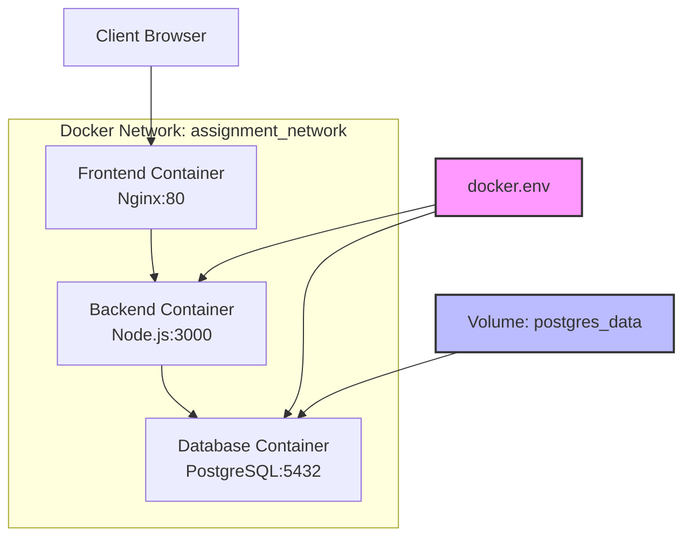

# Docker Deployment Guide

This project uses Docker and Docker Compose for containerized deployment, including frontend, backend, and database services.

## Project Architecture

```
Assignment Moderation System
├── Frontend (Nginx) - Port 80
├── Backend (Node.js) - Port 3000  
└── Database (PostgreSQL) - Port 5432
```

## Prerequisites

Ensure the following software is installed on your system:

- [Docker Desktop](https://www.docker.com/products/docker-desktop/) (Windows/Mac)
- [Docker Engine](https://docs.docker.com/engine/install/) (Linux)
- [Docker Compose](https://docs.docker.com/compose/install/) (usually included in Docker Desktop)

Verify installation:
```bash
docker --version
docker-compose --version
```

## 🚀 Quick Start

### 1. Clone the Project and Navigate to Directory
```bash
git clone <your-repository>
cd IT-Project-80
```

### 2. Configure Environment Variables (⭐ Important)
```bash
# Copy environment variable template
cp docker.env.example docker.env

# Edit docker.env file and modify configuration as needed
# Especially the database password: DB_PASSWORD=your_preferred_password
```

### 3. Start All Services
```bash
# Build and start all containers
docker-compose up --build

# Or run in the background
docker-compose up --build -d
```

### 4. Access the Application
- **Frontend**: http://localhost
- **Backend API**: http://localhost:3000/api
- **Health Check**: http://localhost:3000/api/health

### 5. Default Login Credentials
If this is your first startup, you can use the following default credentials:
- **Email**: admin@grading.com
- **Password**: admin123
- **Role**: Coordinator

## 👥 Team Collaboration Guide

### Steps for New Team Members

1. **Get Project Code**
   ```bash
   git clone <repository-url>
   cd IT-Project-80
   ```

2. **Set Personal Environment Variables**
   ```bash
   # Copy environment variable template
   cp docker.env.example docker.env
   
   # Edit docker.env and modify the following:
   # - DB_PASSWORD=your_personal_password
   # - Other personal preference settings
   ```

3. **Start the Project**
   ```bash
   docker-compose up --build -d
   ```

4. **Verify Installation**
   ```bash
   # Check all service status
   docker-compose ps
   
   # Visit http://localhost to confirm frontend is working
   # Visit http://localhost:3000/api/health to confirm backend is working
   ```

### Important Reminders
- ❌ **Do NOT commit `docker.env` file to version control**
- ✅ **Only commit `docker.env.example` template file**
- 💬 **When encountering issues, first check your `docker.env` configuration**

## Common Commands

### Service Management
```bash
# Start services
docker-compose up

# Start in background
docker-compose up -d

# Stop services
docker-compose down

# Stop and remove volume data
docker-compose down -v

# Restart specific service
docker-compose restart backend

# View service status
docker-compose ps

# View service logs
docker-compose logs
docker-compose logs backend  # View specific service logs
docker-compose logs -f frontend  # Follow logs in real-time
```

### Build Management
```bash
# Rebuild all images
docker-compose build

# Rebuild specific service
docker-compose build backend

# Force rebuild (no cache)
docker-compose build --no-cache

# Pull latest base images and build
docker-compose build --pull
```

### Database Management
```bash
# Enter database container
docker-compose exec database psql -U postgres -d assignment_mod

# View users in database
docker-compose exec database psql -U postgres -d assignment_mod -c "SELECT email, name, role FROM app_user;"

# Backup database
docker-compose exec database pg_dump -U postgres assignment_mod > backup.sql

# Restore database
docker-compose exec -T database psql -U postgres assignment_mod < backup.sql

# View database logs
docker-compose logs database
```

### ⚠️ Database Initialization Mechanism (Important!)

Docker PostgreSQL containers have a special initialization mechanism that's important to understand for development:

#### 🔄 Initialization Process
1. **First Startup** (Fresh data volume):
   - PostgreSQL detects empty data volume `assignment_postgres_data`
   - Automatically executes initialization scripts in `/docker-entrypoint-initdb.d/` directory:
     ```
     01-init.sql    (database/IT SQL.sql - Creates all table structures)
     02-seeds.sql   (database/seeds/initial_data.sql - Inserts initial data)
     ```
   - Creates complete database structure and initial data

2. **Subsequent Startups** (Existing data volume):
   - PostgreSQL finds existing database files in data volume
   - **Skips all initialization scripts**, directly starts existing database
   - Even if you modify `IT SQL.sql`, it won't be re-executed

#### 🚨 Common Misconceptions
Many developers encounter this issue:
- ✅ Modified `database/IT SQL.sql` file
- ❌ Re-run `docker-compose up --build`
- ❌ Find that database structure hasn't updated

**Reason**: Docker skipped the initialization phase because the data volume already exists!

#### 🛠️ How to Apply Database Structure Changes

**Method 1: Re-initialize (Recommended for Development)**
```bash
# 1. Stop all services
docker-compose down

# 2. Remove data volume (⚠️ This will clear all data!)
docker volume rm assignment_postgres_data

# 3. Restart, will re-execute initialization scripts
docker-compose up -d database
```

**Method 2: Manual Execution (Preserve Existing Data)**
```bash
# Execute SQL commands directly in running database
docker-compose exec database psql -U postgres -d assignment_mod -c "
ALTER TABLE project ADD COLUMN new_field TEXT;
"

# Or execute SQL file
docker-compose exec -i database psql -U postgres -d assignment_mod < your_changes.sql
```

**Method 3: Database Migration (Recommended for Production)**
- Create versioned migration scripts
- Use specialized database migration tools
- Don't modify original initialization files

#### 📋 Check Database Status
```bash
# View all tables
docker-compose exec database psql -U postgres -d assignment_mod -c "\dt"

# View specific table structure
docker-compose exec database psql -U postgres -d assignment_mod -c "\d project"

# Check if data volume exists
docker volume ls | grep assignment

# View initialization logs (first startup)
docker-compose logs database
```

### Debugging and Development
```bash
# Enter container
docker-compose exec backend sh
docker-compose exec frontend sh

# View files inside container
docker-compose exec backend ls -la /app

# Follow all logs in real-time
docker-compose logs -f

# Start only database (for local development)
docker-compose up database
```

## 🔧 Environment Variable Configuration

The project uses environment variables for configuration management, main configuration files:

### `docker.env` (Personal configuration, not committed to version control)
```env
# Database configuration
DB_HOST=database
DB_PORT=5432
DB_NAME=assignment_mod
DB_USER=postgres
DB_PASSWORD=your_personal_password  # Change to your password

# Backend configuration
NODE_ENV=production
PORT=3000

# Frontend configuration
FRONTEND_PORT=80
```

### `docker.env.example` (Template file, committed to version control)
- Contains examples of all required environment variables
- Configuration reference for new team members
- Includes detailed configuration explanations

### Environment Variable Descriptions
| Variable | Description | Default Value |
|----------|-------------|---------------|
| `DB_HOST` | Database host | database |
| `DB_PORT` | Database port | 5432 |
| `DB_NAME` | Database name | assignment_mod |
| `DB_USER` | Database user | postgres |
| `DB_PASSWORD` | Database password | assignment_db_2024 |
| `NODE_ENV` | Node.js environment | production |
| `PORT` | Backend port | 3000 |

## Troubleshooting

### Common Issues

1. **Port Already in Use**
   ```bash
   # Check port usage
   netstat -tulpn | grep :80
   netstat -tulpn | grep :3000
   
   # Windows users:
   netstat -ano | findstr :80
   netstat -ano | findstr :3000
   ```

2. **Container Startup Failure**
   ```bash
   # View detailed error logs
   docker-compose logs <service-name>
   
   # Check container status
   docker-compose ps
   ```

3. **Environment Variable Configuration Error**
   ```bash
   # Check if environment variables are loaded correctly
   docker-compose config
   
   # Confirm docker.env file exists
   ls -la docker.env
   ```

4. **Database Connection Failure**
   ```bash
   # Check if database is healthy
   docker-compose exec database pg_isready -U postgres
   
   # Restart database service
   docker-compose restart database
   
   # Check if database password is correct
   docker-compose exec database psql -U postgres -d assignment_mod
   ```

5. **Login Failure - User Does Not Exist**
   ```bash
   # Check if user data exists in database
   docker-compose exec database psql -U postgres -d assignment_mod -c "SELECT * FROM app_user;"
   
   # If no data, manually insert default user
   docker-compose exec database psql -U postgres -d assignment_mod -c "
   INSERT INTO app_user (name, email, password_hash, role, is_active) 
   VALUES ('admin', 'admin@grading.com', 'admin123', 'COORDINATOR', true);"
   ```

6. **Insufficient Disk Space**
   ```bash
   # Clean unused images and containers
   docker system prune
   
   # Clean unused volumes
   docker volume prune
   ```

7. **Database Structure Changes Not Applied**
   ```bash
   # Issue: Modified database/IT SQL.sql but database structure not updated
   # Reason: Docker only executes initialization scripts on first startup
   
   # Solution 1: Re-initialize database (development environment)
   docker-compose down
   docker volume rm assignment_postgres_data
   docker-compose up -d database
   
   # Solution 2: Manual execution (preserve data)
   docker-compose exec database psql -U postgres -d assignment_mod -c "YOUR_SQL_COMMAND;"
   
   # Verify changes took effect
   docker-compose exec database psql -U postgres -d assignment_mod -c "\dt"
   ```

### Complete Reset
If you encounter serious issues, you can completely reset:
```bash
# Stop all services and delete data
docker-compose down -v

# Remove all images
docker-compose down --rmi all

# Rebuild and start
docker-compose up --build
```

### Log Analysis
```bash
# View all service status
docker-compose ps

# Check service health status
docker-compose exec backend wget -qO- http://localhost:3000/api/health || curl http://localhost:3000/api/health
docker-compose exec frontend wget -qO- http://localhost:80 || curl http://localhost:80

# Monitor resource usage in real-time
docker stats
```

## Development Mode

If you want to use Docker during development:

1. **Start only database**:
   ```bash
   docker-compose up database
   ```

2. **Run backend locally**:
   ```bash
   cd backend
   npm install
   npm start
   ```

3. **Serve frontend locally**:
   ```bash
   cd frontend
   # Use any static file server, like Live Server or http-server
   npx http-server . -p 8080
   ```

## Production Deployment Considerations

1. **Security Configuration**:
   - ✅ Change default database password
   - ✅ Use strong passwords
   - ✅ Configure firewall rules
   - ✅ Use HTTPS
   - ✅ Limit database access permissions

2. **Performance Optimization**:
   - Use production mode Node.js
   - Enable Nginx caching
   - Configure database connection pooling
   - Set appropriate resource limits

3. **Monitoring and Logging**:
   - Set up log rotation
   - Configure health checks
   - Use monitoring tools (like Prometheus + Grafana)
   - Set up alerting mechanisms

4. **Backup Strategy**:
   ```bash
   # Regular database backup
   docker-compose exec database pg_dump -U postgres assignment_mod > backup_$(date +%Y%m%d_%H%M%S).sql
   ```

## Architecture Diagram



## Technology Stack

- **Frontend**: HTML/CSS/JavaScript + Nginx
- **Backend**: Node.js + Express
- **Database**: PostgreSQL 15
- **Container**: Docker + Docker Compose
- **Reverse Proxy**: Nginx (API proxy)

## 📞 Getting Help

If you encounter issues, please check in the following order:

1. ✅ Confirm `docker.env` file is correctly configured
2. ✅ Check Docker and Docker Compose versions
3. ✅ Confirm ports are not occupied
4. ✅ Check if system resources are sufficient
5. ✅ View detailed error logs

### Common Check Commands
```bash
# Check environment
docker --version
docker-compose --version

# Check configuration
docker-compose config

# Check service status
docker-compose ps

# View logs
docker-compose logs
```

For more help, please refer to:
- [Docker Official Documentation](https://docs.docker.com/)
- [Docker Compose Official Documentation](https://docs.docker.com/compose/)
- Project Issues page

---

**💡 Tip**: When running the project for the first time, it's recommended to start in foreground mode (`docker-compose up --build`) to observe the startup process and any potential error messages.