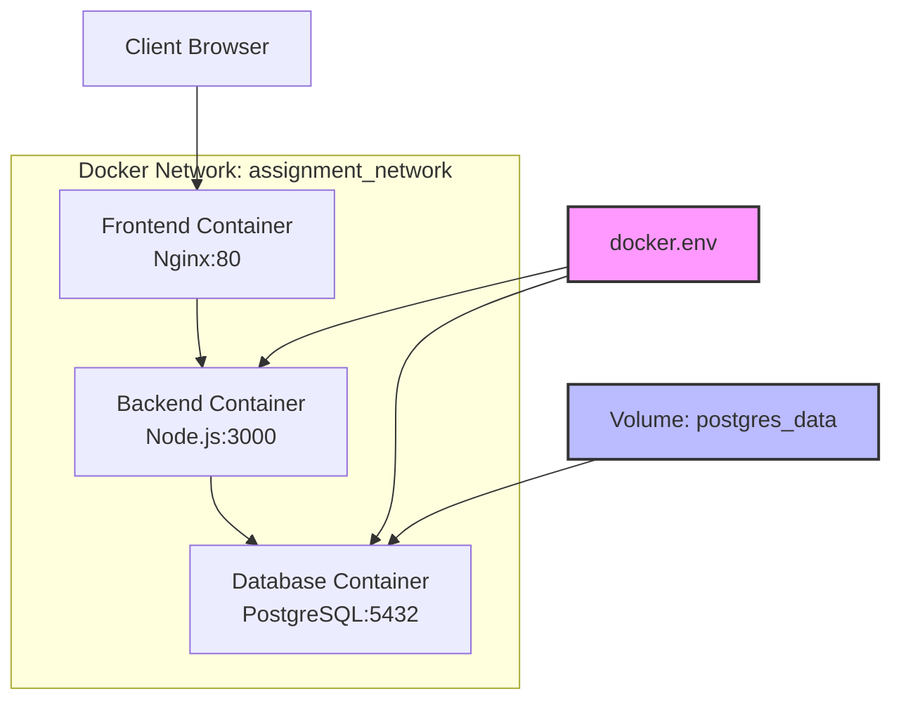

# Docker 部署指南

本项目使用 Docker 和 Docker Compose 进行容器化部署，包含前端、后端和数据库三个服务。

## 项目架构

```
Assignment Moderation System
├── Frontend (Nginx) - 端口 80
├── Backend (Node.js) - 端口 3000  
└── Database (PostgreSQL) - 端口 5432
```

## 前置要求

确保你的系统已安装以下软件：

- [Docker Desktop](https://www.docker.com/products/docker-desktop/) (Windows/Mac)
- [Docker Engine](https://docs.docker.com/engine/install/) (Linux)
- [Docker Compose](https://docs.docker.com/compose/install/) (通常包含在 Docker Desktop 中)

验证安装：
```bash
docker --version
docker-compose --version
```

## 🚀 快速启动

### 1. 克隆项目并进入目录
```bash
git clone <your-repository>
cd IT-Project-80
```

### 2. 配置环境变量 (⭐ 重要)
```bash
# 复制环境变量模板
cp docker.env.example docker.env

# 编辑 docker.env 文件，根据需要修改配置
# 特别是数据库密码：DB_PASSWORD=your_preferred_password
```

### 3. 启动所有服务
```bash
# 构建并启动所有容器
docker-compose up --build

# 或者在后台运行
docker-compose up --build -d
```

### 4. 访问应用
- **前端**: http://localhost
- **后端API**: http://localhost:3000/api
- **健康检查**: http://localhost:3000/api/health

### 5. 默认登录凭据
如果是首次启动，可以使用以下默认凭据登录：
- **邮箱**: admin@grading.com
- **密码**: admin123
- **角色**: Coordinator

## 👥 团队协作指南

### 新团队成员加入步骤

1. **获取项目代码**
   ```bash
   git clone <repository-url>
   cd IT-Project-80
   ```

2. **设置个人环境变量**
   ```bash
   # 复制环境变量模板
   cp docker.env.example docker.env
   
   # 编辑 docker.env，修改以下内容：
   # - DB_PASSWORD=your_personal_password
   # - 其他个人偏好设置
   ```

3. **启动项目**
   ```bash
   docker-compose up --build -d
   ```

4. **验证安装**
   ```bash
   # 检查所有服务状态
   docker-compose ps
   
   # 访问 http://localhost 确认前端正常
   # 访问 http://localhost:3000/api/health 确认后端正常
   ```

### 重要提醒
- ❌ **不要提交 `docker.env` 文件到版本控制**
- ✅ **只提交 `docker.env.example` 模板文件**
- 💬 **遇到问题时，先检查你的 `docker.env` 配置**

## 常用命令

### 服务管理
```bash
# 启动服务
docker-compose up

# 后台启动
docker-compose up -d

# 停止服务
docker-compose down

# 停止并删除卷数据
docker-compose down -v

# 重启特定服务
docker-compose restart backend

# 查看服务状态
docker-compose ps

# 查看服务日志
docker-compose logs
docker-compose logs backend  # 查看特定服务日志
docker-compose logs -f frontend  # 实时跟踪日志
```

### 构建管理
```bash
# 重新构建所有镜像
docker-compose build

# 重新构建特定服务
docker-compose build backend

# 强制重新构建（不使用缓存）
docker-compose build --no-cache

# 拉取最新基础镜像并构建
docker-compose build --pull
```

### 数据库管理
```bash
# 进入数据库容器
docker-compose exec database psql -U postgres -d assignment_mod

# 查看数据库中的用户
docker-compose exec database psql -U postgres -d assignment_mod -c "SELECT email, name, role FROM app_user;"

# 备份数据库
docker-compose exec database pg_dump -U postgres assignment_mod > backup.sql

# 恢复数据库
docker-compose exec -T database psql -U postgres assignment_mod < backup.sql

# 查看数据库日志
docker-compose logs database
```

### 调试和开发
```bash
# 进入容器内部
docker-compose exec backend sh
docker-compose exec frontend sh

# 查看容器内文件
docker-compose exec backend ls -la /app

# 实时查看所有日志
docker-compose logs -f

# 只启动数据库（用于本地开发）
docker-compose up database
```

## 🔧 环境变量配置

项目使用环境变量进行配置管理，主要配置文件：

### `docker.env` (个人配置，不提交到版本控制)
```env
# 数据库配置
DB_HOST=database
DB_PORT=5432
DB_NAME=assignment_mod
DB_USER=postgres
DB_PASSWORD=your_personal_password  # 修改为你的密码

# 后端配置
NODE_ENV=production
PORT=3000

# 前端配置
FRONTEND_PORT=80
```

### `docker.env.example` (模板文件，提交到版本控制)
- 包含所有必需的环境变量示例
- 新团队成员的配置参考
- 包含详细的配置说明

### 环境变量说明
| 变量名 | 说明 | 默认值 |
|--------|------|--------|
| `DB_HOST` | 数据库主机 | database |
| `DB_PORT` | 数据库端口 | 5432 |
| `DB_NAME` | 数据库名称 | assignment_mod |
| `DB_USER` | 数据库用户 | postgres |
| `DB_PASSWORD` | 数据库密码 | assignment_db_2024 |
| `NODE_ENV` | Node.js 环境 | production |
| `PORT` | 后端端口 | 3000 |

## 故障排除

### 常见问题

1. **端口占用**
   ```bash
   # 检查端口使用情况
   netstat -tulpn | grep :80
   netstat -tulpn | grep :3000
   
   # Windows 用户使用：
   netstat -ano | findstr :80
   netstat -ano | findstr :3000
   ```

2. **容器启动失败**
   ```bash
   # 查看详细错误日志
   docker-compose logs <service-name>
   
   # 检查容器状态
   docker-compose ps
   ```

3. **环境变量配置错误**
   ```bash
   # 检查环境变量是否正确加载
   docker-compose config
   
   # 确认 docker.env 文件存在
   ls -la docker.env
   ```

4. **数据库连接失败**
   ```bash
   # 检查数据库是否健康
   docker-compose exec database pg_isready -U postgres
   
   # 重启数据库服务
   docker-compose restart database
   
   # 检查数据库密码是否正确
   docker-compose exec database psql -U postgres -d assignment_mod
   ```

5. **登录失败 - 用户不存在**
   ```bash
   # 检查数据库中是否有用户数据
   docker-compose exec database psql -U postgres -d assignment_mod -c "SELECT * FROM app_user;"
   
   # 如果没有数据，手动插入默认用户
   docker-compose exec database psql -U postgres -d assignment_mod -c "
   INSERT INTO app_user (name, email, password_hash, role, is_active) 
   VALUES ('admin', 'admin@grading.com', 'admin123', 'COORDINATOR', true);"
   ```

6. **磁盘空间不足**
   ```bash
   # 清理未使用的镜像和容器
   docker system prune
   
   # 清理未使用的卷
   docker volume prune
   ```

### 完全重置
如果遇到严重问题，可以完全重置：
```bash
# 停止所有服务并删除数据
docker-compose down -v

# 删除所有镜像
docker-compose down --rmi all

# 重新构建和启动
docker-compose up --build
```

### 日志分析
```bash
# 查看所有服务状态
docker-compose ps

# 检查服务健康状态
docker-compose exec backend wget -qO- http://localhost:3000/api/health || curl http://localhost:3000/api/health
docker-compose exec frontend wget -qO- http://localhost:80 || curl http://localhost:80

# 实时监控资源使用
docker stats
```

## 开发模式

如果你想在开发过程中使用 Docker：

1. **只启动数据库**:
   ```bash
   docker-compose up database
   ```

2. **本地运行后端**:
   ```bash
   cd backend
   npm install
   npm start
   ```

3. **本地提供前端**:
   ```bash
   cd frontend
   # 使用任何静态文件服务器，如 Live Server 或 http-server
   npx http-server . -p 8080
   ```

## 生产部署注意事项

1. **安全配置**:
   - ✅ 修改默认数据库密码
   - ✅ 使用强密码
   - ✅ 配置防火墙规则
   - ✅ 使用 HTTPS
   - ✅ 限制数据库访问权限

2. **性能优化**:
   - 使用生产模式的 Node.js
   - 启用 Nginx 缓存
   - 配置数据库连接池
   - 设置适当的资源限制

3. **监控和日志**:
   - 设置日志轮转
   - 配置健康检查
   - 使用监控工具（如 Prometheus + Grafana）
   - 设置告警机制

4. **备份策略**:
   ```bash
   # 定期备份数据库
   docker-compose exec database pg_dump -U postgres assignment_mod > backup_$(date +%Y%m%d_%H%M%S).sql
   ```

## 架构图



## 技术栈

- **Frontend**: HTML/CSS/JavaScript + Nginx
- **Backend**: Node.js + Express
- **Database**: PostgreSQL 15
- **Container**: Docker + Docker Compose
- **Reverse Proxy**: Nginx (API 代理)

## 📞 获取帮助

如果遇到问题，请按以下顺序检查：

1. ✅ 确认 `docker.env` 文件已正确配置
2. ✅ 检查 Docker 和 Docker Compose 版本
3. ✅ 确认端口是否被占用
4. ✅ 检查系统资源是否充足
5. ✅ 查看详细的错误日志

### 常用检查命令
```bash
# 检查环境
docker --version
docker-compose --version

# 检查配置
docker-compose config

# 检查服务状态
docker-compose ps

# 查看日志
docker-compose logs
```

更多帮助请参考：
- [Docker 官方文档](https://docs.docker.com/)
- [Docker Compose 官方文档](https://docs.docker.com/compose/)
- 项目 Issues 页面

---

**💡 提示**: 第一次运行项目时，建议在前台模式启动 (`docker-compose up --build`) 以便观察启动过程和可能的错误信息。