# IT-Project-80
Repository for IT Project - Group 80

Project: Assignment Moderation Tool

## Team Members

**Scrum Master:** Hanyu Ji

**Product Owner:** Ruonan Xiong

**Team Members:**
- Hanyu Ji, 1400387, hanyuj2@student.unimelb.edu.au
- Ruonan Xiong, 1345959, xionrx@student.unimelb.edu.au
- Yuqiao Cui, 1407018, yuqcui1@student.unimelb.edu.au
- Renchuan Xu, 1473816, renchuanx@student.unimelb.edu.au
- Yangchenxu Zhang, 1393078, yangchenxuz@student.unimelb.edu.au

## Project Structure

```
IT-Project-80/
├── README.md
├── docker-compose.yml          # Docker orchestration
├── docker.env                  # Docker environment variables
├── docker.env.example          # Docker env template
├── DOCKER_README.md            # Docker setup guide
├── package.json                # Root-level tools/scripts
├── run-tests.sh                # Local/CI test script
├── test_debug.html             # Frontend debug page
├── test_image_readme/          # README image assets
│   └── img_*.png
├── uploads/                    # Example upload directory (runtime-generated)
│   └── 2025/
│       └── 10/
├── backend/                    # Node.js backend service
│   ├── Dockerfile
│   ├── jest.config.js
│   ├── node_modules/           # Installed dependencies (generated)
│   ├── package.json
│   ├── package-lock.json
│   ├── run-migration.js
│   ├── temp_uploads/           # Temporary upload staging
│   ├── uploads/                # Persistent uploads
│   │   └── 2025/
│   │       └── 09/
│   └── src/                    # Application source code
│       ├── app.js
│       ├── generateHashes.js
│       ├── config/             # Configuration
│       │   ├── constants.js
│       │   ├── database.js
│       │   └── email.js
│       ├── controllers/        # Controllers
│       │   ├── authController.js
│       │   ├── authController.test.js
│       │   ├── dashboardController.js
│       │   ├── invitationController.js
│       │   ├── profileController.js
│       │   └── uploads.js
│       ├── jobs/               # Background jobs/cron
│       │   └── deadlineNotifier.js
│       ├── middleware/         # Request middleware
│       │   ├── auth.js
│       │   ├── auth.test.js
│       │   ├── errorHandler.js
│       │   ├── projectValidation.js
│       │   ├── roleAuth.js
│       │   └── roleAuth.test.js
│       ├── migrations/         # Database migrations
│       │   └── encrypt_existing_passwords.js
│       ├── routes/             # REST API routes
│       │   ├── auth.js
│       │   ├── dashboard.js
│       │   ├── feedback1.js
│       │   ├── index.js
│       │   ├── invitations.js
│       │   ├── page.js
│       │   └── uploads_v2.js
│       ├── services/           # Business services
│       │   └── emailService.js
│       ├── templates/          # Email templates
│       │   └── emailTemplates/
│       │       ├── assignment-published-notification-email.html
│       │       ├── deadline-passed-email.html
│       │       ├── due-soon-email.html
│       │       ├── feedback-notification-email.html
│       │       ├── invitation-email.html
│       │       ├── marking-completed-email.html
│       │       ├── new-assignment-notification-email.html
│       │       └── reset-password-email.html
│       └── utils/              # Utility helpers
│           ├── enhanced_rubric_parser.js
│           ├── fileParser.js
│           ├── helpers.js
│           ├── helpers.test.js
│           ├── passwordUtils.js
│           └── templateUtils.js
├── frontend/                   # Static frontend (HTML/CSS/JS)
│   ├── Dockerfile
│   ├── nginx.conf
│   ├── package.json
│   ├── package-lock.json
│   ├── test-setup.js
│   ├── __mocks__/              # Jest style mocks
│   │   └── styleMock.js
│   ├── login.html
│   ├── login.js
│   ├── login.test.js
│   ├── signup.html
│   ├── signup.js
│   ├── signup.test.js
│   ├── confirm.html
│   ├── forgot-password.html
│   ├── reset-password.html
│   ├── styles.css
│   ├── styles copy.css
│   ├── Coordinator/            # Coordinator UI pages
│   │   ├── change-password.css
│   │   ├── coordinator-dashboard.css
│   │   ├── coordinator-dashboard.html
│   │   ├── coordinator.js
│   │   ├── feedback.css
│   │   ├── feedback.html
│   │   ├── feedback.js
│   │   ├── invite.css
│   │   ├── invite.html
│   │   ├── invite.js
│   │   ├── mark-assignment.css
│   │   ├── mark-assignment.html
│   │   ├── mark-assignment.js
│   │   ├── onboarding-modal.css
│   │   ├── past-assignment.css
│   │   ├── past-assignment.html
│   │   ├── past-assignment.js
│   │   ├── profile.css
│   │   ├── rubric.css
│   │   ├── rubric.html
│   │   ├── rubric.js
│   │   ├── task-management.css
│   │   ├── task-management.html
│   │   └── task-management.js
│   └── Marker/                 # Marker UI pages
│       ├── marker-dashboard.css
│       ├── marker-dashboard.html
│       ├── marker.js
│       ├── marker.test.js
│       ├── onboarding-modal.css
│       ├── past-task.css
│       ├── past-task.html
│       ├── past-task.js
│       ├── task-management.css
│       ├── task-management.html
│       ├── task-management.js
│       ├── view-feedback.css
│       ├── view-feedback.html
│       └── view-feedback.js
├── database/                   # Database scripts
│   ├── IT SQL.sql
│   ├── listTables.sql
│   ├── add_marker_user.sql
│   ├── add_deviation_percent_to_baseline_score.sql
│   ├── add_total_deviation_percent_to_assignment.sql
│   ├── test_data.sql
│   └── seeds/                  # Seed data
│       └── initial_data.sql
└── test/                       # Test assets
    ├── doc/                    # Sample documents for demo/tests
    │   ├── assigment test.pdf
    │   └── rubric test.xlsx
    └── image_readme/           # README screenshots
        ├── image1.png
        ├── image2.png
        ├── image3.png
        ├── image4.png
        ├── image5.png
        ├── image6.png
        ├── image7.png
        ├── image8.png
        ├── image9.png
        ├── image10.png
        ├── image11.png
        ├── image12.png
        ├── image13.png
        ├── image14.png
        ├── image15.png
        ├── image16.png
        ├── image17.png
        └── image18.png
```

## Getting Started & Demo

### Local Setup and Running

For local development and testing, please follow our Docker implementation guide:

📖 **[Complete Docker Setup Guide](DOCKER_README.md)**

#### Quick Start with Docker

1. **Prerequisites**: Ensure Docker and Docker Compose are installed on your system
2. **Clone the repository** and navigate to the project directory
3. **Run the application**:
   ```bash
   docker-compose up --build
   ```
4. **Wait for initialization**: The setup process takes a few seconds. Once you see the completion message in terminal, the application is ready
5. **Access the application**: Open your browser and navigate to `http://localhost`

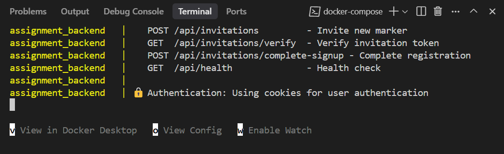

### Demo Walkthrough

#### 1. Administrator Login

Open the application at `http://localhost` and log in with the test admin account:

- **Username**: `admin@grading.com`
- **Password**: `admin123`

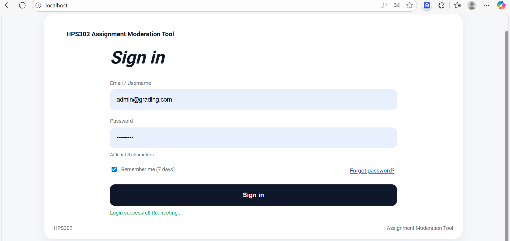

Upon successful login, you'll be redirected to the Coordinator Dashboard.

#### 2. Coordinator Dashboard Overview

The dashboard provides an overview of the current system status. Note that some overview features are still in development and display placeholder content.

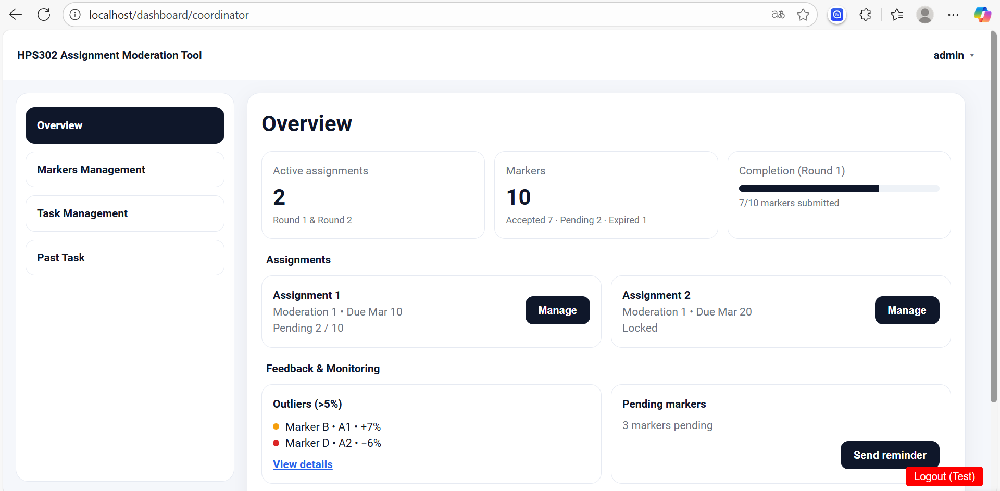

#### 3. Marker Management

Navigate to **"Markers Management"** to manage marker accounts:

- **Invite new markers**: Enter an email address to send invitations
- **Manage existing markers**: Use "Resend" and "Revoke" buttons to manage invitations
- **Test functionality**: You can use your own email address for testing

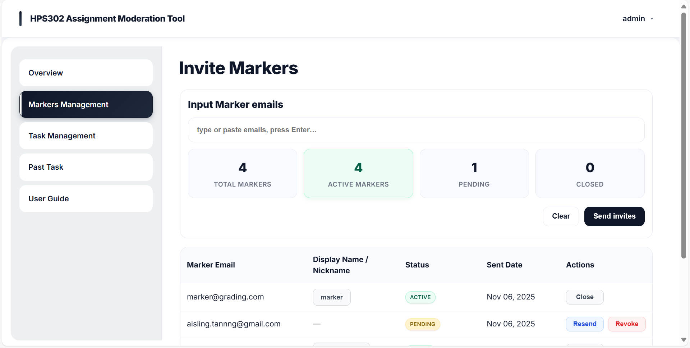

#### 4. Email Invitation System

When a marker invitation is sent, the recipient receives an email invitation:

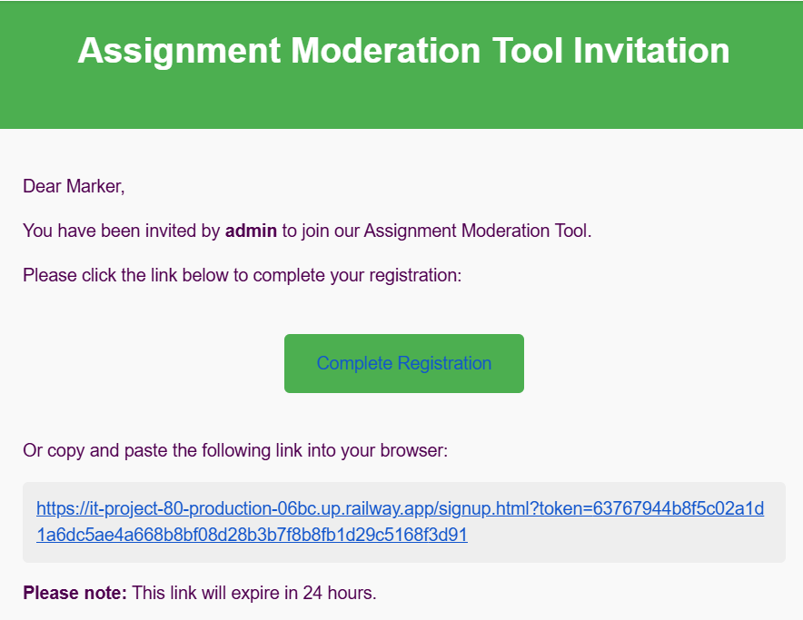

Click the link in the email to complete marker registration:

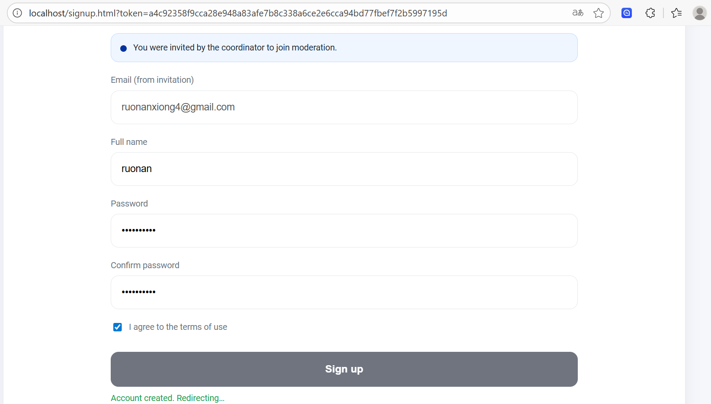

#### 5. Marker Dashboard

After registration, markers can log in with their credentials to access the marker interface:

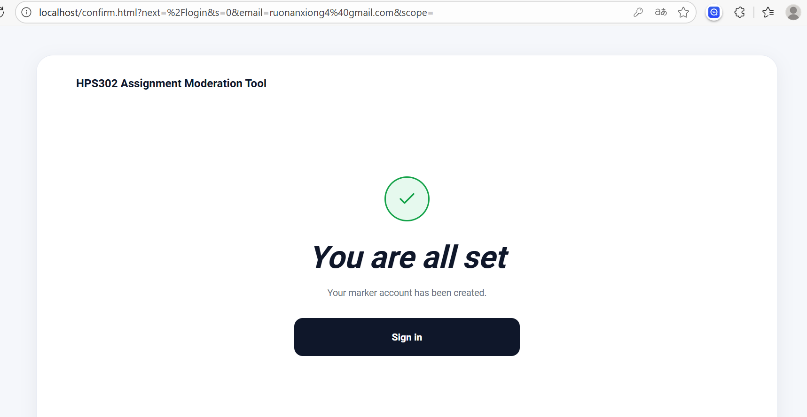
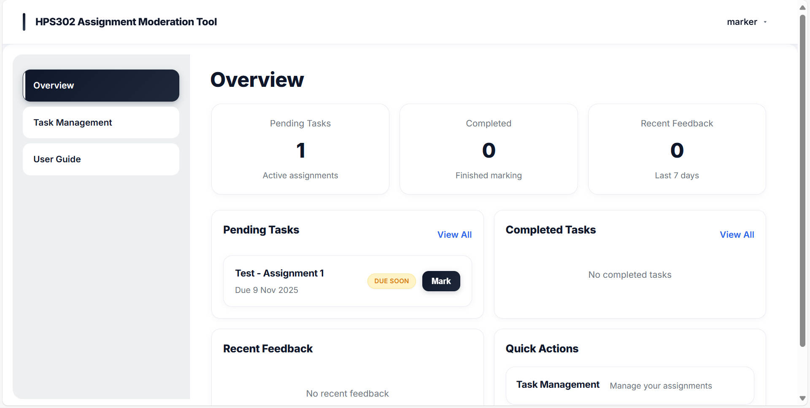


*Note: The marker interface is currently in display mode with limited functionality.*

#### 6. Task Management

Return to the Coordinator Dashboard and click **"Task Management"**:

**Creating a New Task:**

1. Click **"Add New Task"**
2. Click **"Create"** 
3. Enter the project name
4. The task is successfully created

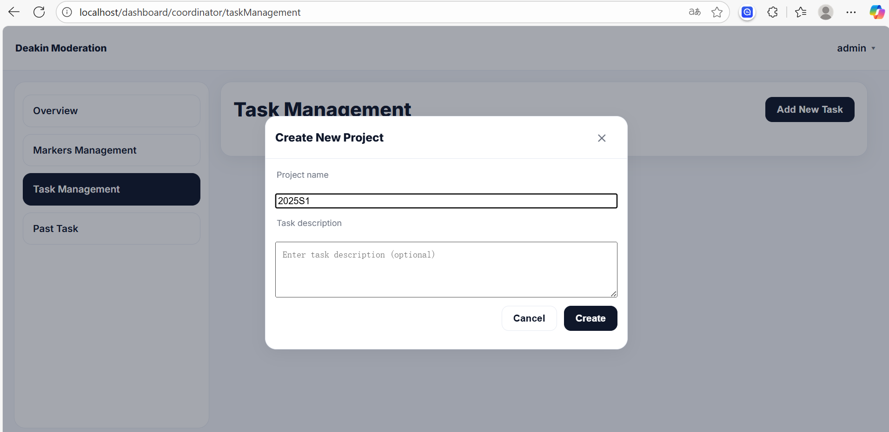

#### 7. Rubric Upload

**Upload a rubric for the task:**

1. Click **"Upload Rubric"**
2. Select the test file: `test/doc/rubric test.xlsx`
3. Upload the rubric file

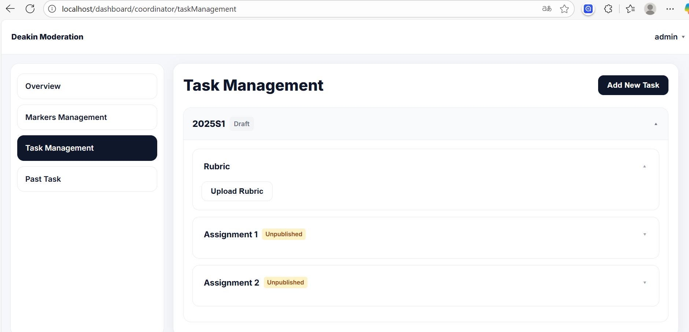

**View the uploaded rubric:**

Click **"View Rubric"** to see the rubric content:

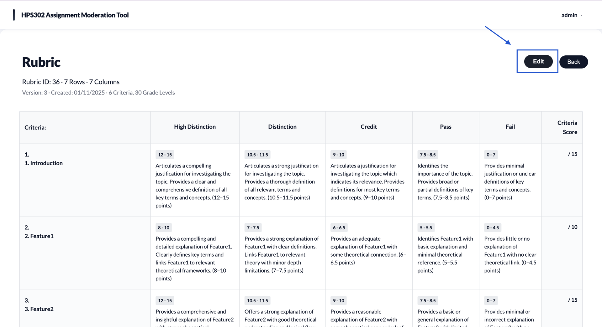

#### 8. Assignment Upload

**Upload assignment files:**

1. Click **"Upload Assignment"**
2. Select the test file: `test/doc/assignment test.pdf`
3. Upload the assignment

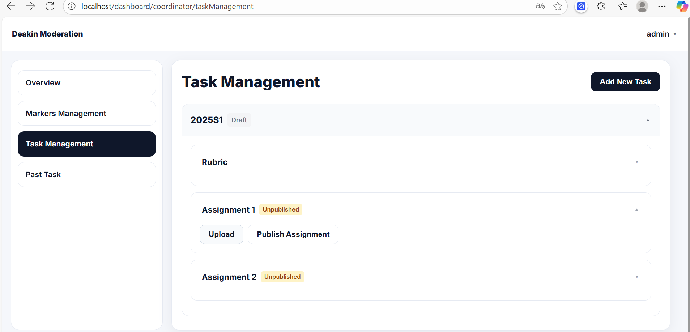

#### 9. Task Activation

After uploading both rubric and assignment:

1. Click **"Publish Assignment"**
2. The task is now activated and ready for marking

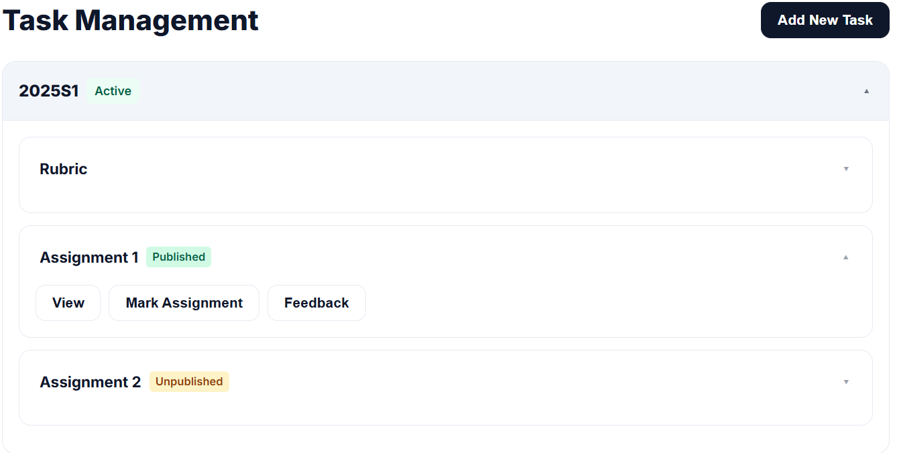

#### 10. Marking Interface

Access the marking functionality:

1. Click **"Mark Assignment"**
2. Enter scores for different criteria
3. Confirm the scores and click **"Submit"**

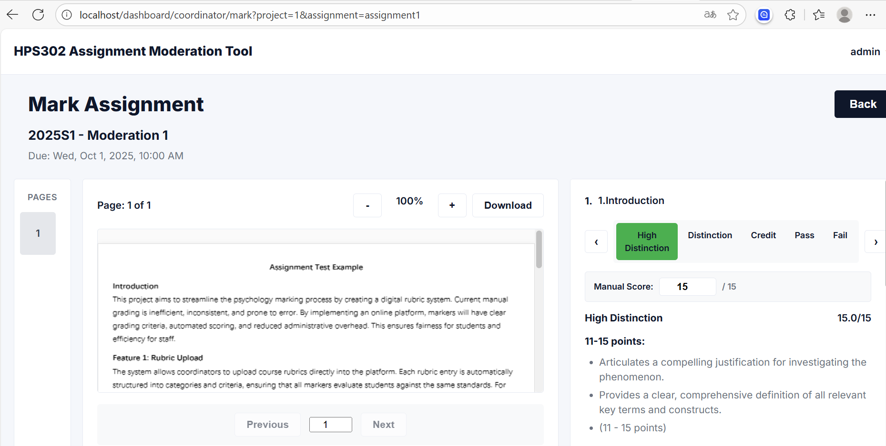

The marking is successfully submitted.

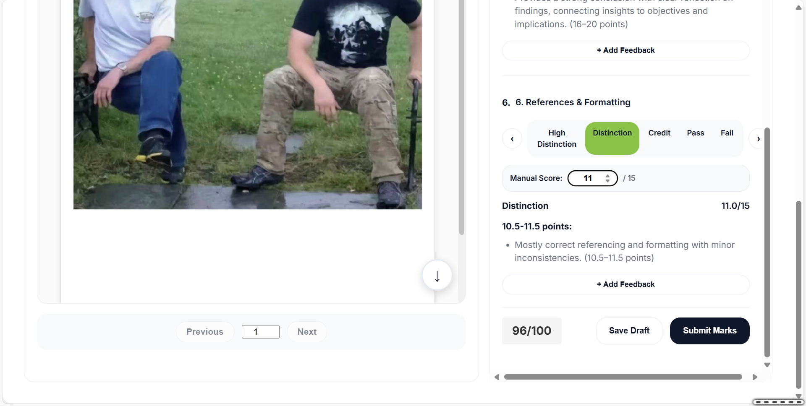

#### 11. Feedback System

The feedback interface is available but currently in display mode:

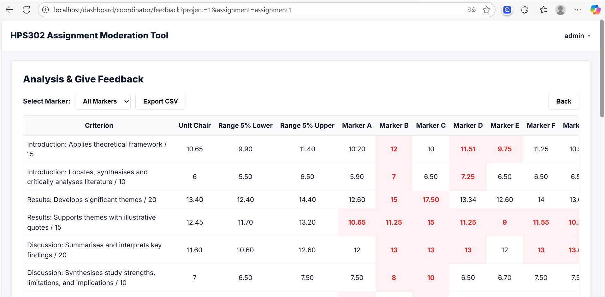

*Note: Feedback functionality is under development.*

#### 12. Historical Tasks

Return to the dashboard to view historical task examples:

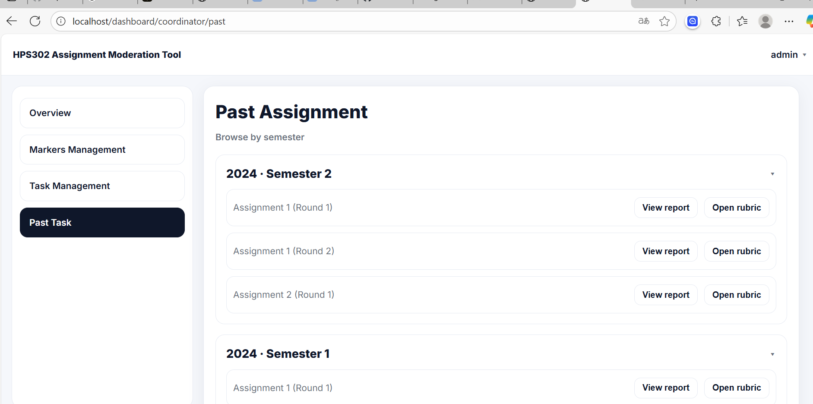

This demonstrates how coordinators can track previous assignments and tasks.

### Alternative Access - Live Deployment

If you encounter issues with local Docker setup, you can access our deployed version:

🌐 **Live Demo**: [https://it-project-80-production-06bc.up.railway.app/](https://it-project-80-production-06bc.up.railway.app/)

*Use the same testing procedures and credentials as described above.*

---

## Features Summary

### Current Implementation Status

✅ **Completed Features:**
- User authentication system (Admin/Coordinator/Marker roles)
- Email invitation system for markers
- Task creation and management
- Rubric upload and parsing (.xlsx format)
- Assignment upload (.pdf format)
- Basic marking interface
- Docker containerization
- Database integration (PostgreSQL)

🚧 **In Development:**
- Dashboard overview functionality
- Complete marker interface integration
- Feedback system implementation
- Advanced reporting features

### Test Files Location

For testing uploads, use the following test files:
- **Rubric**: `test/doc/rubric test.xlsx`
- **Assignment**: `test/doc/assignment test.pdf`
