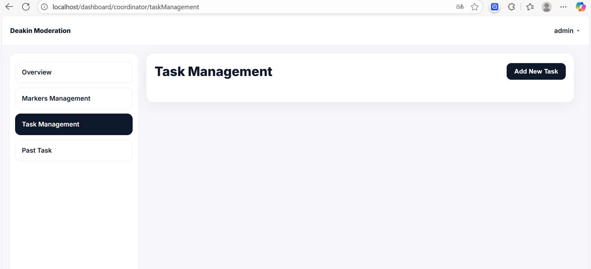

# IT-Project-80
Repository for IT Project - Group 80

Project: Assignment Moderation Tool

## Team Members

**Scrum Master:** Hanyu Ji

**Product Owner:** Ruonan Xiong

**Team Members:**
- Hanyu Ji, 1400387, hanyuj2@student.unimelb.edu.au
- Ruonan Xiong, 1345959, xionrx@student.unimelb.edu.au
- Yuqiao Cui, 1407018, yuqcui1@student.unimelb.edu.au
- Renchuan Xu, 1473816, renchuanx@student.unimelb.edu.au
- Yangchenxu Zhang, 1393078, yangchenxuz@student.unimelb.edu.au

## Project Structure

```
IT-Project-80/
├── README.md
├── .gitignore
├── docker-compose.yml          # Docker development environment
├── docker.env                 # Docker environment variables
├── docker.env.example         # Docker environment template
├── DOCKER_README.md           # Docker setup documentation
├── LOGIN_TEST.md              # Login testing documentation
├── 
├── backend/                   # Node.js API Service
│   ├── Dockerfile
│   ├── package.json
│   ├── package-lock.json
│   ├── src/
│   │   ├── app.js            # Main application file
│   │   ├── config/           # Configuration files
│   │   │   ├── constants.js
│   │   │   ├── database.js
│   │   │   └── email.js
│   │   ├── middleware/       # Middleware
│   │   │   ├── auth.js
│   │   │   ├── errorHandler.js
│   │   │   ├── projectValidation.js
│   │   │   └── roleAuth.js
│   │   ├── routes/           # API routes
│   │   │   ├── index.js
│   │   │   ├── auth.js
│   │   │   ├── dashboard.js
│   │   │   ├── invitations.js
│   │   │   ├── page.js
│   │   │   └── uploads_v2.js
│   │   ├── controllers/      # Controllers
│   │   │   ├── authController.js
│   │   │   ├── dashboardController.js
│   │   │   ├── invitationController.js
│   │   │   └── uploads.js
│   │   ├── models/           # Data models (empty)
│   │   ├── services/         # Business logic
│   │   │   └── emailService.js
│   │   ├── templates/        # Email templates
│   │   │   └── emailTemplates/
│   │   │       ├── invitation-email.html
│   │   │       └── revocation-email.html
│   │   └── utils/            # Utility functions
│   │       ├── enhanced_rubric_parser.js
│   │       ├── fileParser.js
│   │       ├── helpers.js
│   │       └── templateUtils.js
│   └── tests/               # Test files
│       ├── unit/
│       └── integration/
├── 
├── frontend/                # HTML/CSS/JS Frontend Application
│   ├── Dockerfile
│   ├── nginx.conf           # Nginx configuration
│   ├── login.html           # Login page
│   ├── login.js
│   ├── signup.html          # Signup page
│   ├── signup.js
│   ├── confirm.html         # Confirmation page
│   ├── styles.css           # Global styles
│   ├── styles copy.css
│   ├── public/              # Static assets
│   ├── dist/                # Build output
│   ├── src/                 # Source code structure
│   │   ├── assets/
│   │   ├── components/
│   │   │   ├── common/
│   │   │   ├── forms/
│   │   │   └── layout/
│   │   ├── router/
│   │   ├── services/
│   │   ├── stores/
│   │   ├── utils/
│   │   └── views/
│   │       └── Assignment/
│   ├── Coordinator/         # Coordinator dashboard pages
│   │   ├── coordinator-dashboard.html
│   │   ├── coordinator-dashboard.css
│   │   ├── coordinator.js
│   │   ├── feedback.html
│   │   ├── feedback.css
│   │   ├── feedback.js
│   │   ├── invite.html
│   │   ├── invite.css
│   │   ├── invite.js
│   │   ├── mark-assignment.html
│   │   ├── mark-assignment.css
│   │   ├── mark-assignment.js
│   │   ├── past-assignment.html
│   │   ├── past-assignment.css
│   │   ├── past-assignment.js
│   │   ├── rubric.html
│   │   ├── rubric.css
│   │   ├── rubric.js
│   │   ├── task-management.html
│   │   ├── task-management.css
│   │   └── task-management.js
│   └── Marker/              # Marker dashboard pages
│       ├── marker-dashboard.html
│       ├── marker-dashboard.css
│       └── marker.js
│
├── database/               # Database related
│   ├── IT SQL.sql         # Main database schema
│   ├── migrations/        # Database migrations (empty)
│   ├── scripts/           # Database scripts (empty)
│   └── seeds/             # Initial data
│       └── initial_data.sql
│
├── docs/                  # Documentation (empty)
├── image_use/             # Image resources
└── test_image_readme/     # README images
    ├── img.png
    ├── img_1.png
    ├── img_2.png
    ├── img_3.png
    ├── img_4.png
    ├── img_5.png
    └── img_6.png
```

## Getting Started & Demo

### Local Setup and Running

For local development and testing, please follow our Docker implementation guide:

📖 **[Complete Docker Setup Guide](DOCKER_README.md)**

#### Quick Start with Docker

1. **Prerequisites**: Ensure Docker and Docker Compose are installed on your system
2. **Clone the repository** and navigate to the project directory
3. **Run the application**:
   ```bash
   docker-compose up --build
   ```
4. **Wait for initialization**: The setup process takes a few seconds. Once you see the completion message in terminal, the application is ready
5. **Access the application**: Open your browser and navigate to `http://localhost`


### Demo Walkthrough

#### 1. Administrator Login

Open the application at `http://localhost` and log in with the test admin account:

- **Username**: `admin@grading.com`
- **Password**: `admin123`


Upon successful login, you'll be redirected to the Coordinator Dashboard.


#### 2. Coordinator Dashboard Overview

The dashboard provides an overview of the current system status. Note that some overview features are still in development and display placeholder content.


#### 3. Marker Management

Navigate to **"Markers Management"** to manage marker accounts:

- **Invite new markers**: Enter an email address to send invitations
- **Manage existing markers**: Use "Resend" and "Revoke" buttons to manage invitations
- **Test functionality**: You can use your own email address for testing


#### 4. Email Invitation System

When a marker invitation is sent, the recipient receives an email invitation:


Click the link in the email to complete marker registration:


#### 5. Marker Dashboard

After registration, markers can log in with their credentials to access the marker interface:


*Note: The marker interface is currently in display mode with limited functionality.*

#### 6. Task Management

Return to the Coordinator Dashboard and click **"Task Management"**:



**Creating a New Task:**

1. Click **"Add New Task"**
2. Click **"Create"** 
3. Enter the project name
4. The task is successfully created


#### 7. Rubric Upload

**Upload a rubric for the task:**

1. Click **"Upload Rubric"**
2. Select the test file: `test/doc/rubric test.xlsx`
3. Upload the rubric file


**View the uploaded rubric:**

Click **"View Rubric"** to see the rubric content:


#### 8. Assignment Upload

**Upload assignment files:**

1. Click **"Upload Assignment"**
2. Select the test file: `test/doc/assignment test.pdf`
3. Upload the assignment


#### 9. Task Activation

After uploading both rubric and assignment:

1. Click **"Publish Assignment"**
2. The task is now activated and ready for marking


#### 10. Marking Interface

Access the marking functionality:

1. Click **"Mark Assignment"**
2. Enter scores for different criteria
3. Confirm the scores and click **"Submit"**


The marking is successfully submitted.


#### 11. Feedback System

The feedback interface is available but currently in display mode:


*Note: Feedback functionality is under development.*

#### 12. Historical Tasks

Return to the dashboard to view historical task examples:


This demonstrates how coordinators can track previous assignments and tasks.

### Alternative Access - Live Deployment

If you encounter issues with local Docker setup, you can access our deployed version:

🌐 **Live Demo**: [https://it-project-80-production-06bc.up.railway.app/](https://it-project-80-production-06bc.up.railway.app/)

*Use the same testing procedures and credentials as described above.*

---

## Features Summary

### Current Implementation Status

✅ **Completed Features:**
- User authentication system (Admin/Coordinator/Marker roles)
- Email invitation system for markers
- Task creation and management
- Rubric upload and parsing (.xlsx format)
- Assignment upload (.pdf format)
- Basic marking interface
- Docker containerization
- Database integration (PostgreSQL)

🚧 **In Development:**
- Dashboard overview functionality
- Complete marker interface integration
- Feedback system implementation
- Advanced reporting features

### Test Files Location

For testing uploads, use the following test files:
- **Rubric**: `test/doc/rubric test.xlsx`
- **Assignment**: `test/doc/assignment test.pdf`
