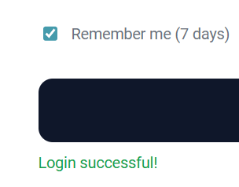
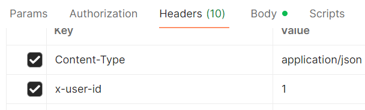
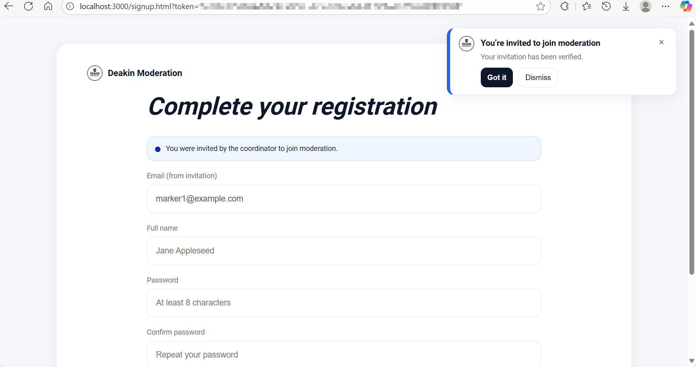
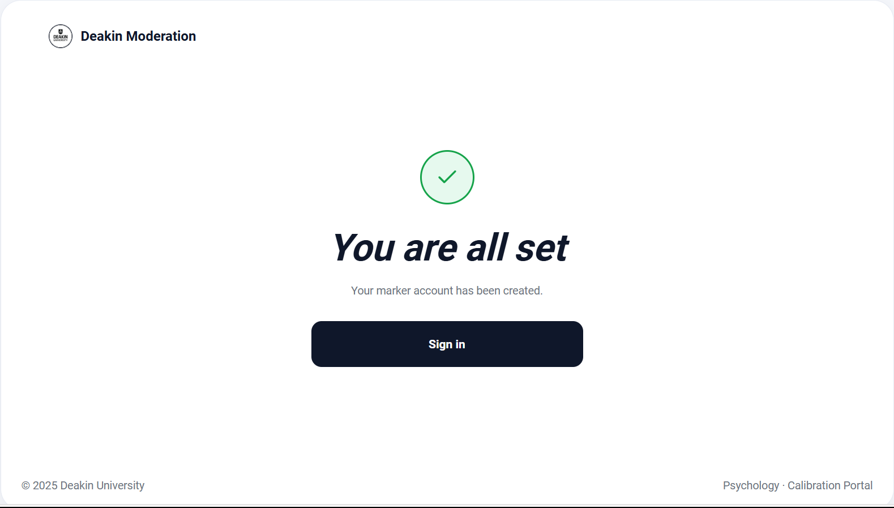
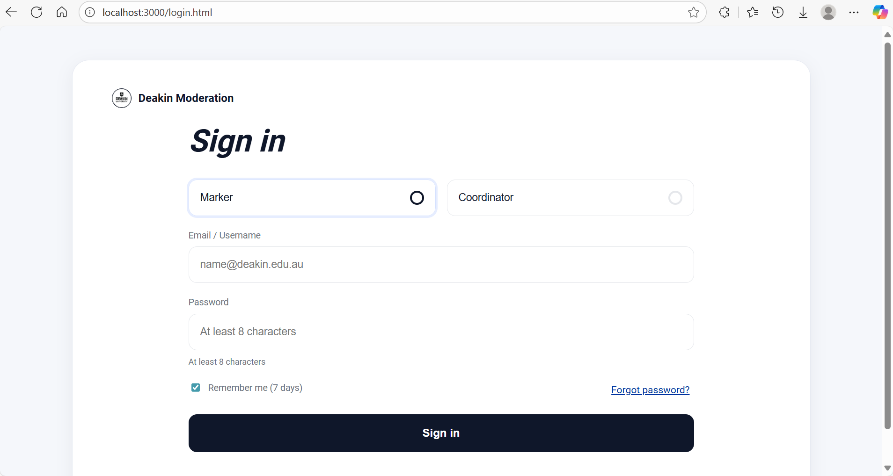
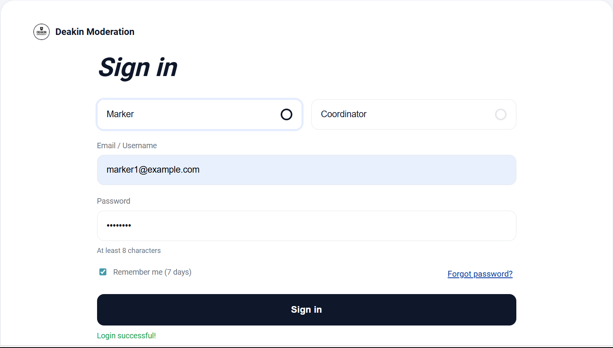

# IT-Project-80
Repository for IT Project - Group 80

Project: Assignment Moderation Tool

## Team Members

**Scrum Master:** Hanyu Ji

**Product Owner:** Ruonan Xiong

**Team Members:**
- Hanyu Ji, 1400387, hanyuj2@student.unimelb.edu.au
- Ruonan Xiong, 1345959, xionrx@student.unimelb.edu.au
- Yuqiao Cui, 1407018, yuqcui1@student.unimelb.edu.au
- Renchuan Xu, 1473816, renchuanx@student.unimelb.edu.au
- Yangchenxu Zhang, 1393078, yangchenxuz@student.unimelb.edu.au

## Project Structure

```
assignment-moderation-tool/
├── README.md
├── .gitignore
├── docker-compose.yml          # Local development environment
├── 
├── backend/                    # Node.js API Service
│   ├── package.json
│   ├── .env.example
│   ├── .env                   # Local environment variables
│   ├── src/
│   │   ├── app.js            # Main application file
│   │   ├── config/           # Configuration files
│   │   │   ├── database.js
│   │   │   ├── auth.js
│   │   │   └── constants.js
│   │   ├── middleware/       # Middleware
│   │   │   ├── auth.js
│   │   │   ├── validation.js
│   │   │   └── errorHandler.js
│   │   ├── routes/           # Modularized routes
│   │   │   ├── index.js
│   │   │   ├── auth.js
│   │   │   ├── invitations.js
│   │   │   ├── assignments.js
│   │   │   └── scoring.js
│   │   ├── controllers/      # Controllers
│   │   │   ├── authController.js
│   │   │   ├── invitationController.js
│   │   │   └── assignmentController.js
│   │   ├── models/           # Data models
│   │   │   ├── User.js
│   │   │   ├── Assignment.js
│   │   │   └── Submission.js
│   │   ├── services/         # Business logic
│   │   │   ├── authService.js
│   │   │   ├── emailService.js
│   │   │   └── scoringService.js
│   │   └── utils/            # Utility functions
│   │       ├── encryption.js
│   │       ├── validation.js
│   │       └── helpers.js
│   └── tests/               # Test files
│       ├── unit/
│       └── integration/
├── 
├── frontend/                # React/Vue Frontend Application
│   ├── package.json
│   ├── public/
│   │   └── index.html
│   ├── src/
│   │   ├── main.js          # Entry file
│   │   ├── App.vue          # Main component
│   │   ├── router/          # Routing configuration
│   │   ├── components/      # Common components
│   │   │   ├── common/
│   │   │   ├── forms/
│   │   │   └── layout/
│   │   ├── views/           # Page components
│   │   │   ├── Login.vue
│   │   │   ├── Signup.vue
│   │   │   ├── Dashboard.vue
│   │   │   └── Assignment/
│   │   ├── stores/          # State management
│   │   │   ├── auth.js
│   │   │   └── assignments.js
│   │   ├── services/        # API calls
│   │   │   ├── api.js
│   │   │   ├── auth.js
│   │   │   └── assignments.js
│   │   ├── utils/           # Utility functions
│   │   └── assets/          # Static resources
│   └── dist/               # Build output
│
├── database/               # Database related
│   ├── migrations/         # Database migrations
│   │   ├── 001_initial.sql
│   │   └── 002_add_indexes.sql
│   ├── seeds/             # Initial data
│   │   └── initial_data.sql
│   └── scripts/           # Database scripts
│       ├── setup.sh
│       └── backup.sh
│
├── docs/                  # Documentation
│   ├── API.md            # API documentation
│   ├── DATABASE.md       # Database design documentation
│   └── DEPLOYMENT.md     # Deployment documentation
│
└── scripts/              # Deployment and development scripts
    ├── dev-start.sh
    ├── build.sh
    └── deploy.sh
```

## Login and invitation test steps:

1. Create a database locally.
   - Make sure you have installed the PostgreSQL database. If not, you can download and install it from [the PostgreSQL website](https://www.postgresql.org/download/).
   - Open the database pgAdmin4 (if it cannot be found, you can search for pgAdmin4 on the start interface)
   - Log in to your PostgreSQL server (usually localhost, port 5432, username postgres, and password is the one you set during installation).
   - Create a new database named `assignment_mod`:
     - Right-click on "Databases" in the left sidebar and select "Create" > "Database...".
     - Enter `assignment_mod` as the database name and click "Save".
   - Set up an initial user (for example, username `admin`, password `password`), and ensure that this user has all permissions for the `assignment_mod` database.
   - To insert an initial "admin" database table, you can use the following SQL command:
     ```sql
     INSERT INTO app_user (name, email, password_hash, role, is_active)
     VALUES (
      'admin',
      'admin@grading.com',
      'admin123',
      'COORDINATOR',
      true
     );
     ```
   - Make sure that the database connection configuration in backend/src/config/database.js matches your database settings (such as the username, password - it should be the password you set during installation, the host and the port).
2. Start the backend server:
   - Make sure that you have installed all the dependencies (`npm install`, `node.js`, `express`, etc.).
   - Open the terminal at the current project location
   - Run `node backend/src/app.js` to start the backend server.
3. Test login:
   1. Open the browser and visit `http://localhost:3000/login.html`
      
      You should see the login page:
      
   2. Input the email/username and password to log in.

      If you are using the above SQL, then enter:
         - Email/Username: admin@grading.com/admin
         - Password: admin123
      
      Then can see "Login successful!"：
      

4. Test invitation:

   Postman Usage Declaration: We use Postman because we haven't completed the transition of the login-dashboard-invitation interface yet. Once it's completed later, we won't need Postman.
   
   1. Download Postman from [the Postman website](https://www.postman.com/downloads/) and install it.
   2. Open Postman and enter "POST" http://localhost:3000/api/invitations
   3. add headers
        ```
        Content-Type: application/json
        x-user-id: 1
        ```
        
   4. add body -> raw -> JSON
      ```json
      {
       "email": "marker1@example.com"
      }
       ```
   5. Click "Send"
   
      You should see the response like this:
      ```json
      {
       "success": true,
       "message": "Invitation sent successfully"
       }
   6. In the terminal, copy the token: XXX
   7. Open the browser and visit http://localhost:3000/signup.html?token=XXX
      
      will see the signup page:
      
      Enter your username and password, check the terms of agreement, and click "Sign Up".
   8. After successful registration, you will see:
      
      Click "Sign in" to navigate to the login page.
   9. It will return to the previous login interface.
      
   10. Input the email/username and password to log in.
   11. Clicking on "Sign In" will result in "Login successful!":
      