# IT-Project-80
Repository for IT Project - Group 80

Project: Assignment Moderation Tool

## Team Members

**Scrum Master:** Hanyu Ji

**Product Owner:** Ruonan Xiong

**Team Members:**
- Hanyu Ji, 1400387, hanyuj2@student.unimelb.edu.au
- Ruonan Xiong, 1345959, xionrx@student.unimelb.edu.au
- Yuqiao Cui, 1407018, yuqcui1@student.unimelb.edu.au
- Renchuan Xu, 1473816, renchuanx@student.unimelb.edu.au
- Yangchenxu Zhang, 1393078, yangchenxuz@student.unimelb.edu.au

## Project Structure

```
IT-Project-80/
├── README.md
├── docker-compose.yml          # Docker orchestration
├── docker.env                  # Docker environment variables
├── docker.env.example          # Docker env template
├── DOCKER_README.md            # Docker setup guide
├── package.json                # Root-level tools/scripts
├── run-tests.sh                # Local/CI test script
├── test_debug.html             # Frontend debug page
├── test_image_readme/          # README image assets
│   └── img_*.png
├── uploads/                    # Example upload directory (runtime-generated)
│   └── 2025/
│       └── 10/
├── backend/                    # Node.js backend service
│   ├── Dockerfile
│   ├── jest.config.js
│   ├── node_modules/           # Installed dependencies (generated)
│   ├── package.json
│   ├── package-lock.json
│   ├── run-migration.js
│   ├── temp_uploads/           # Temporary upload staging
│   ├── uploads/                # Persistent uploads
│   │   └── 2025/
│   │       └── 09/
│   └── src/                    # Application source code
│       ├── app.js
│       ├── generateHashes.js
│       ├── config/             # Configuration
│       │   ├── constants.js
│       │   ├── database.js
│       │   └── email.js
│       ├── controllers/        # Controllers
│       │   ├── authController.js
│       │   ├── authController.test.js
│       │   ├── dashboardController.js
│       │   ├── invitationController.js
│       │   ├── profileController.js
│       │   └── uploads.js
│       ├── jobs/               # Background jobs/cron
│       │   └── deadlineNotifier.js
│       ├── middleware/         # Request middleware
│       │   ├── auth.js
│       │   ├── auth.test.js
│       │   ├── errorHandler.js
│       │   ├── projectValidation.js
│       │   ├── roleAuth.js
│       │   └── roleAuth.test.js
│       ├── migrations/         # Database migrations
│       │   └── encrypt_existing_passwords.js
│       ├── routes/             # REST API routes
│       │   ├── auth.js
│       │   ├── dashboard.js
│       │   ├── feedback1.js
│       │   ├── index.js
│       │   ├── invitations.js
│       │   ├── page.js
│       │   └── uploads_v2.js
│       ├── services/           # Business services
│       │   └── emailService.js
│       ├── templates/          # Email templates
│       │   └── emailTemplates/
│       │       ├── assignment-published-notification-email.html
│       │       ├── deadline-passed-email.html
│       │       ├── due-soon-email.html
│       │       ├── feedback-notification-email.html
│       │       ├── invitation-email.html
│       │       ├── marking-completed-email.html
│       │       ├── new-assignment-notification-email.html
│       │       └── reset-password-email.html
│       └── utils/              # Utility helpers
│           ├── enhanced_rubric_parser.js
│           ├── fileParser.js
│           ├── helpers.js
│           ├── helpers.test.js
│           ├── passwordUtils.js
│           └── templateUtils.js
├── frontend/                   # Static frontend (HTML/CSS/JS)
│   ├── Dockerfile
│   ├── nginx.conf
│   ├── package.json
│   ├── package-lock.json
│   ├── test-setup.js
│   ├── __mocks__/              # Jest style mocks
│   │   └── styleMock.js
│   ├── login.html
│   ├── login.js
│   ├── login.test.js
│   ├── signup.html
│   ├── signup.js
│   ├── signup.test.js
│   ├── confirm.html
│   ├── forgot-password.html
│   ├── reset-password.html
│   ├── styles.css
│   ├── styles copy.css
│   ├── Coordinator/            # Coordinator UI pages
│   │   ├── change-password.css
│   │   ├── coordinator-dashboard.css
│   │   ├── coordinator-dashboard.html
│   │   ├── coordinator.js
│   │   ├── feedback.css
│   │   ├── feedback.html
│   │   ├── feedback.js
│   │   ├── invite.css
│   │   ├── invite.html
│   │   ├── invite.js
│   │   ├── mark-assignment.css
│   │   ├── mark-assignment.html
│   │   ├── mark-assignment.js
│   │   ├── onboarding-modal.css
│   │   ├── past-assignment.css
│   │   ├── past-assignment.html
│   │   ├── past-assignment.js
│   │   ├── profile.css
│   │   ├── rubric.css
│   │   ├── rubric.html
│   │   ├── rubric.js
│   │   ├── task-management.css
│   │   ├── task-management.html
│   │   └── task-management.js
│   └── Marker/                 # Marker UI pages
│       ├── marker-dashboard.css
│       ├── marker-dashboard.html
│       ├── marker.js
│       ├── marker.test.js
│       ├── onboarding-modal.css
│       ├── past-task.css
│       ├── past-task.html
│       ├── past-task.js
│       ├── task-management.css
│       ├── task-management.html
│       ├── task-management.js
│       ├── view-feedback.css
│       ├── view-feedback.html
│       └── view-feedback.js
├── database/                   # Database scripts
│   ├── IT SQL.sql
│   ├── listTables.sql
│   ├── add_marker_user.sql
│   ├── add_deviation_percent_to_baseline_score.sql
│   ├── add_total_deviation_percent_to_assignment.sql
│   ├── test_data.sql
│   └── seeds/                  # Seed data
│       └── initial_data.sql
└── test/                       # Test assets
    ├── doc/                    # Sample documents for demo/tests
    │   ├── assigment test.pdf
    │   └── rubric test.xlsx
    └── image_readme/           # README screenshots
        └──images
```

## Getting Started & Demo

### Local Setup and Running

For local development and testing, please follow our Docker implementation guide:

📖 **[Complete Docker Setup Guide](DOCKER_README.md)**

#### Quick Start with Docker

1. **Prerequisites**: Ensure Docker and Docker Compose are installed on your system
2. **Clone the repository** and navigate to the project directory
3. **Run the application**:
   ```bash
   docker-compose up --build
   ```
4. **Wait for initialization**: The setup process takes a few seconds. Once you see the completion message in terminal, the application is ready
5. **Access the application**: Open your browser and navigate to `http://localhost`


### Demo Walkthrough

#### 1. Administrator Login

Open the application at `http://localhost` and log in with the test admin account:

- **Username**: `carrie.ewin@gmail.com`
- **Password**: `12345678`


Upon successful login, you'll be redirected to the Coordinator Dashboard.

#### 2. Coordinator Dashboard Overview

The dashboard provides an overview of the current system status. Note that some overview features are still in development and display placeholder content.


#### 3. Marker Management

Navigate to **"Markers Management"** to manage marker accounts:

- **Invite new markers**: Enter an email address to send invitations
- **Manage existing markers**: Use "Resend" and "Revoke" buttons to manage invitations
- **Manage account permission**：Use "Close" and "Open" to manage marker account
- **Add a note for the marker**: click the "Display Name / Nickname" to give marker notes (only coordinator can see)
- **Test functionality**: You can use your own email address for testing


#### 4. Email Invitation System

When a marker invitation is sent, the recipient receives an email invitation:


Click the link in the email to complete marker registration:


#### 5. Marker Dashboard

After registration, markers can log in with their credentials to access the marker interface:


*Note: The marker interface is currently in display mode with limited functionality.*

#### 6. Task Management

Return to the Coordinator Dashboard and click **"Task Management"**:

**Creating a New Task:**

1. Click **"Add New Task"**
2. Click **"Create"** 
3. Enter the project name
4. The task is successfully created


#### 7. Rubric Upload

**Upload a rubric for the task:**

1. Click **"Upload Rubric"**
2. Select the test file: `test/doc/rubric test.xlsx`
3. Upload the rubric file


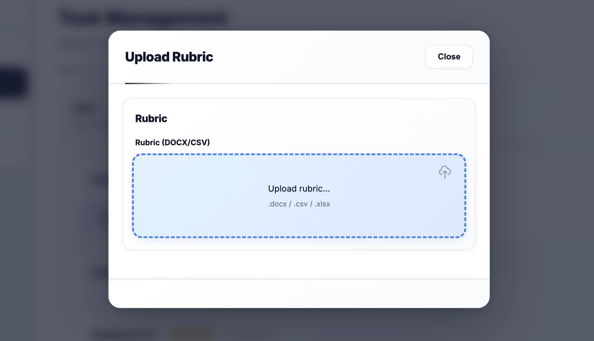

**View the uploaded rubric:**

Click **"View Rubric"** to see the rubric content and can edit rubric as needed:


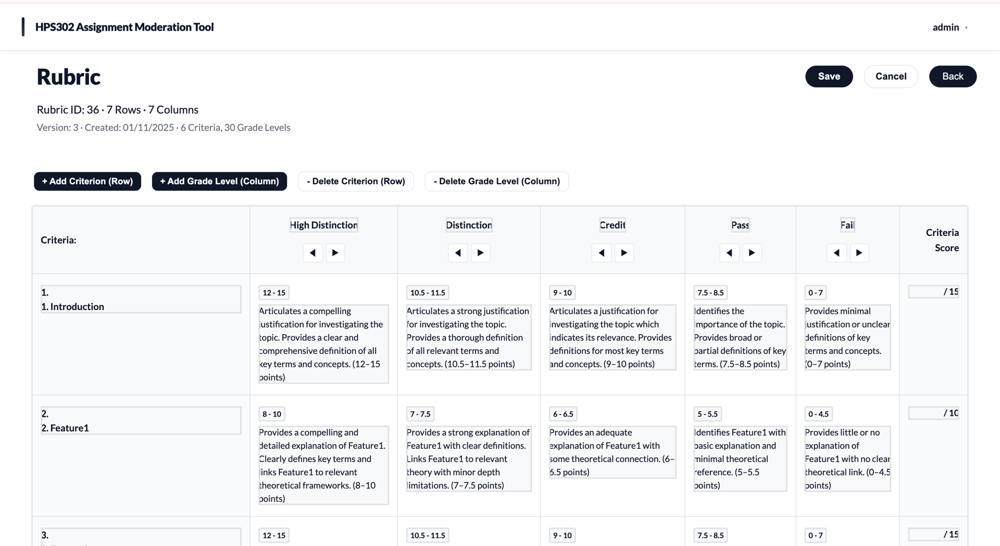  

#### 8. Assignment Upload

**Upload assignment files:**

1. Click **"Upload Assignment"**
2. Select the test file: `test/doc/assignment test.pdf`
3. Preview and upload the assignment


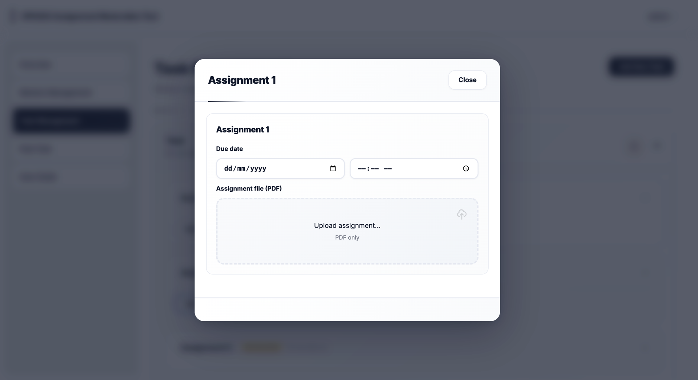

#### 9. Task Activation

After uploading both rubric and assignment:

1. Click **"Publish Assignment"**
2. Preview the information about the assignments
3. The task is now activated and ready for marking


#### 10. Marking Interface

Access the marking functionality:

1. Click **"Mark Assignment"**
2. Enter scores for different criteria
3. Can save the scores as needed
4. Confirm the scores and click **"Submit"**


#### 11. Feedback System

Coordinator view:
1. Open the Feedback page.

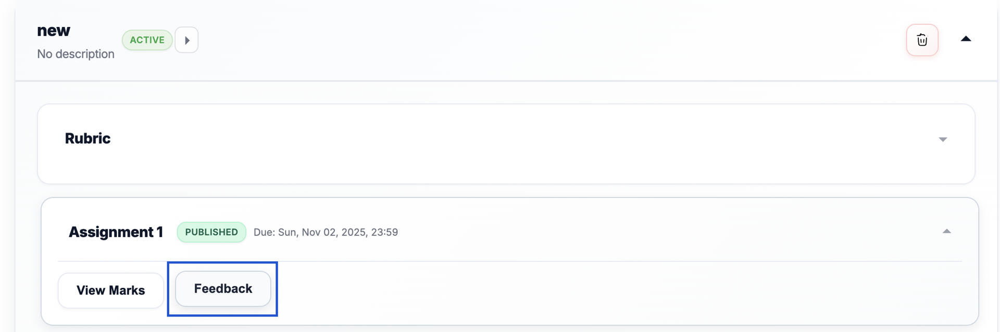

2. View each marker’s scores and comments.
3. Check deviation indicators based on preset or adjustable thresholds.(can adjust deviation percentages per criterion or total score when required.)
4. Review comments and scoring rationale where needed.

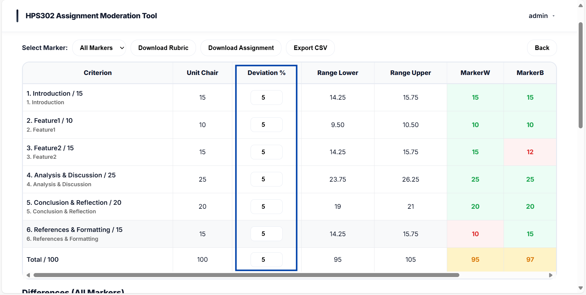

5. Provide Feedback to Markers
Provide feedback to the marker in the comment box, select marker to give feedback.

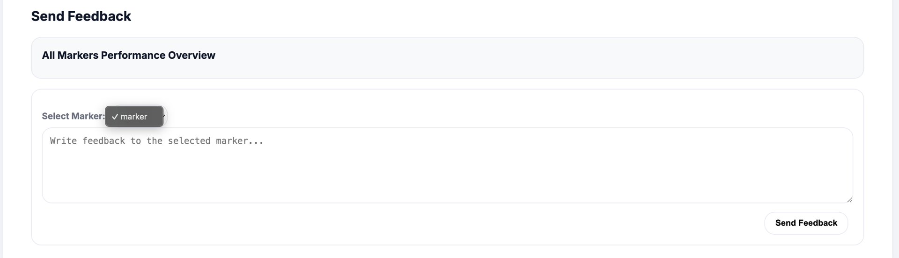

6. View marker individual performance
select a marker

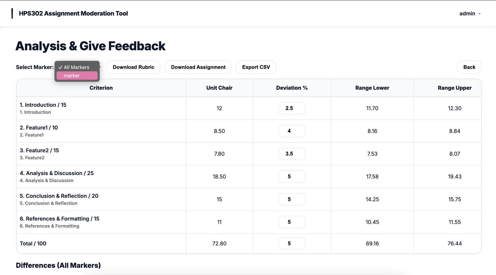

Markers revise scores or provide justification.
Hover grade level to view detailed description among each markers.

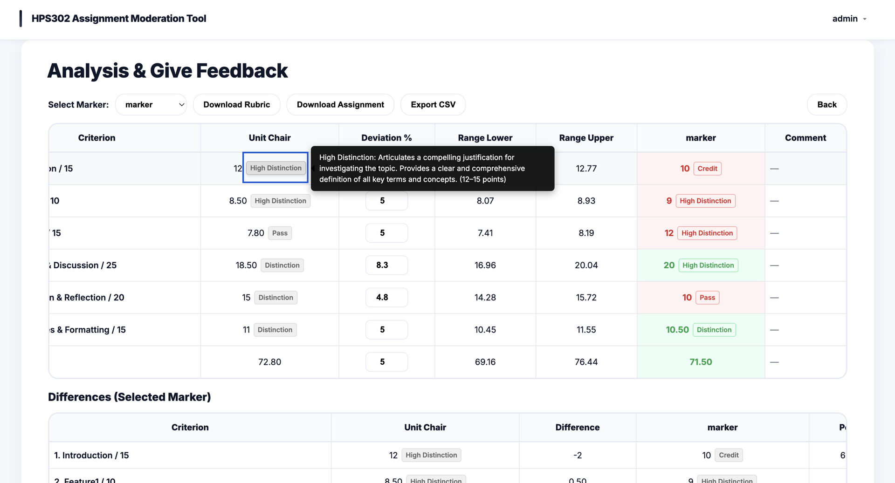

Marker view：
1. Communication & Feedback
Coordinator can leave notes for each marker
Markers can Check feedback in Task management page

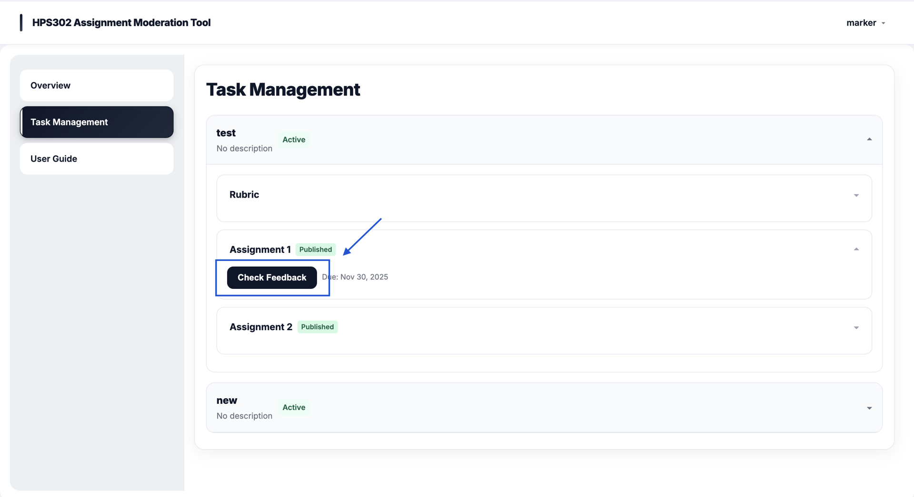

- Note: To avoid losing progress, we recommend saving or submitting marks before navigating away from the page. If you notice the interface not updating immediately, a quick hard refresh ('Command + Shift + R' on Mac / 'Ctrl + Shift + R' on Windows) will reload the latest state.

3. Ensure communication remains professional and aligned with university assessment policies

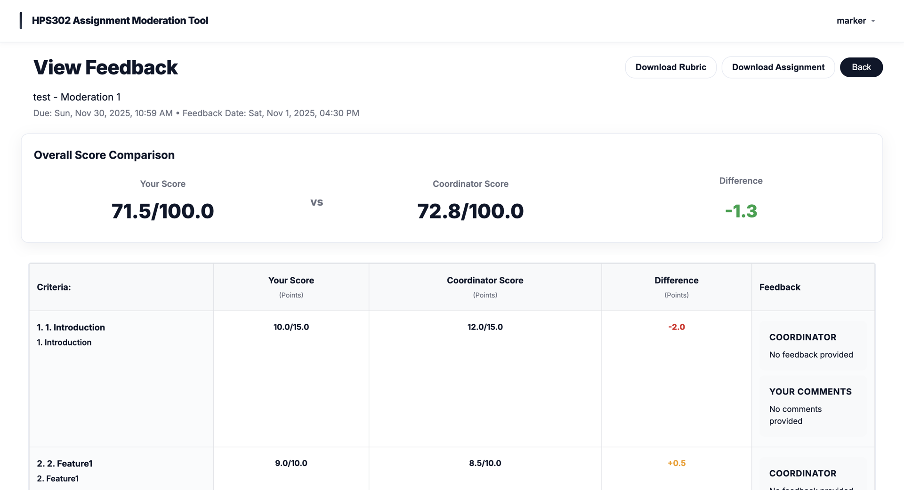

#### 12. Historical Tasks

Once moderation is complete, you can chose to change  status into Complete or Archive to past task.


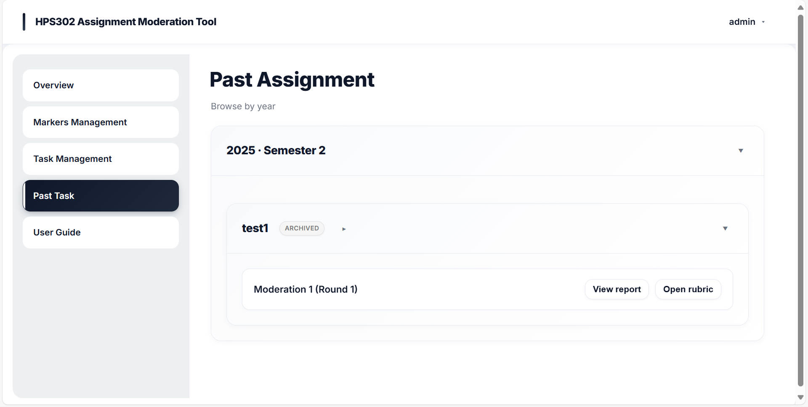  

This demonstrates how coordinators can track previous assignments and tasks.

#### 13. email notification system

Our system will send reminder emails to users in various situations, and they are as follows:
1. Invitation to markers

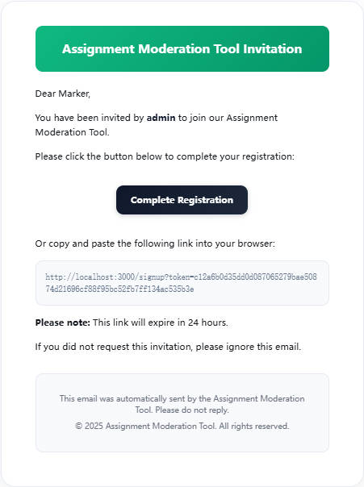  

2. Invitation Revocation

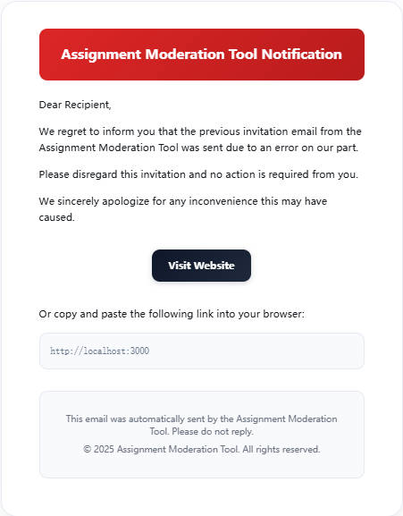

3. Password Reset

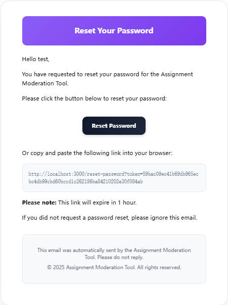

4. New Assignment (Marker)

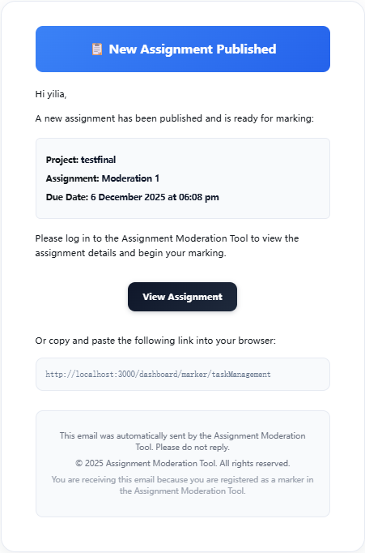

5. Assignment Published (Coordinator)

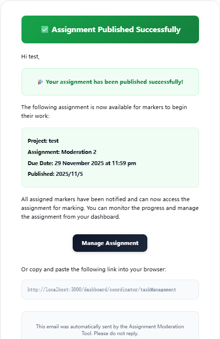  

6. Due Soon (within 2 days to deadlines)

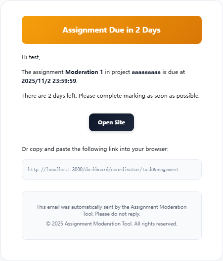

7. Deadline Passed

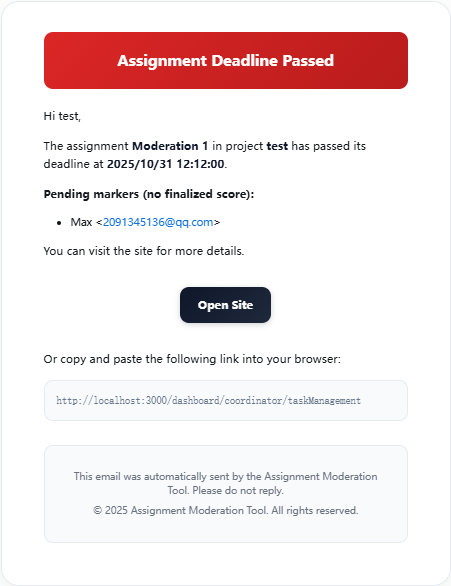

8. Marking Completed  

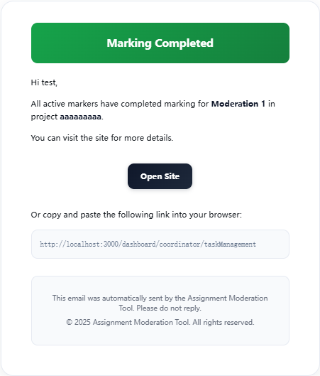

9. Feedback Notification

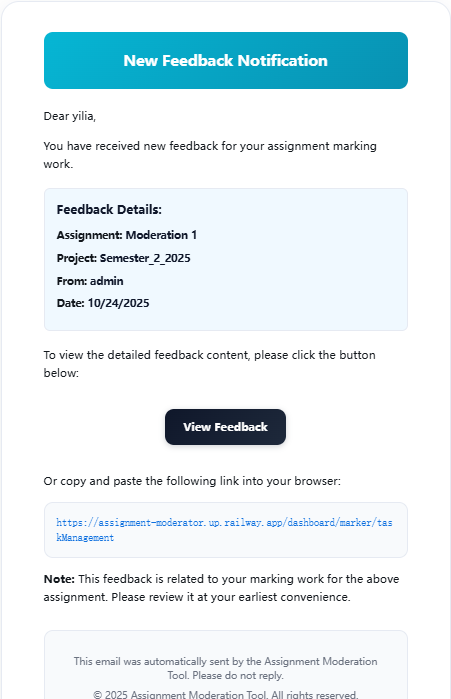


#### 14. forgot and/or reset password

1. Forgot and reset password

In login page, when forgot password, entering account email and will send a email with reset link.

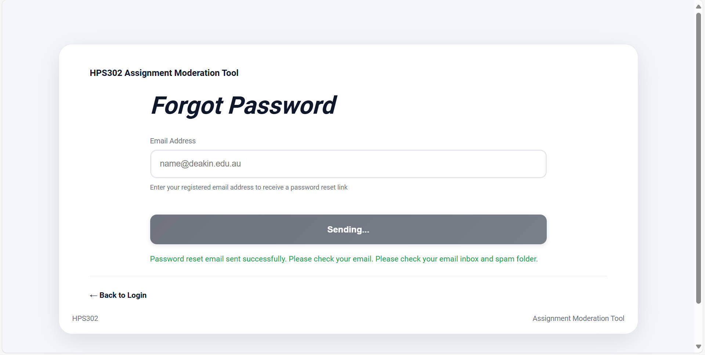

Click link to reset password. 

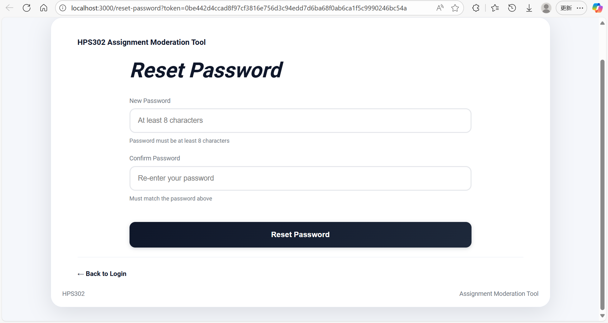

2. Reset password 
On each page, at the top-right corner, there is a pop-up window.

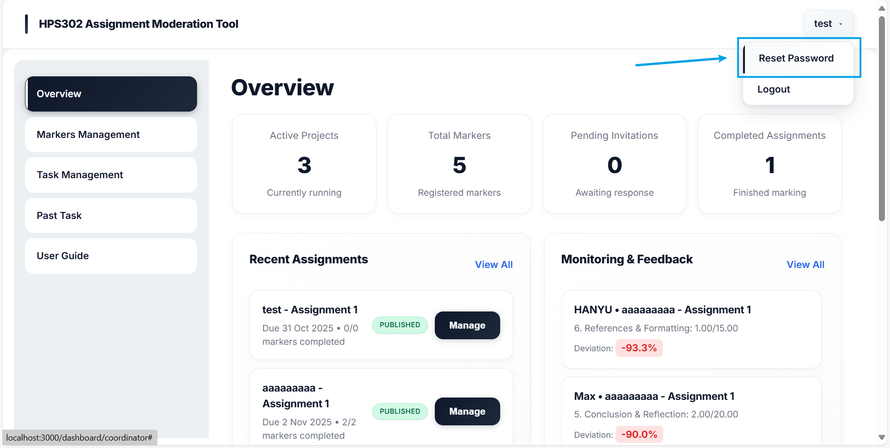

Clicking on it will allow you to reset the password. In the password reset interface, the original password is required for verification. You can also choose to forget the password.

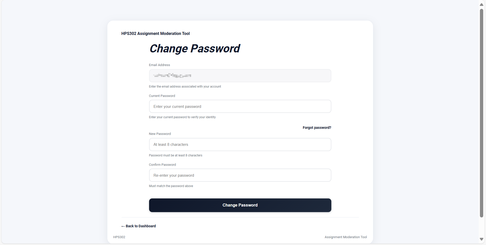

### Alternative Access - Live Deployment

If you encounter issues with local Docker setup, you can access our deployed version:

🌐 **Live Demo**: [https://assignment-moderator.up.railway.app/](https://assignment-moderator.up.railway.app/)

*Use the same testing procedures and credentials as described above.*

---

## Features Summary

### Current Implementation Status

✅ **Completed Features:**
- User authentication system (Admin/Coordinator/Marker roles)
- Email invitation system for markers
- Task creation and management
- Rubric upload and parsing (.docx, .csv formats)
- Assignment upload (.pdf format)
- Basic marking interface with criterion-level scoring and comments
- Coordinator dashboard with overview and progress tracking
- Marker dashboard with pending and completed tasks
- Task management page for marking and submitting scores
- Feedback page for coordinators to review marker submissions and deviations
- Marker management (invite, remind, revoke access)
- Rubric preview and assignment publishing
- Archive functionality for completed tasks
- Docker containerization
- Database integration (PostgreSQL)

### Test Files Location

For testing uploads, use the following test files:
- **Rubric**: `test/doc/rubric test.xlsx`
- **Assignment**: `test/doc/assignment test.pdf`
